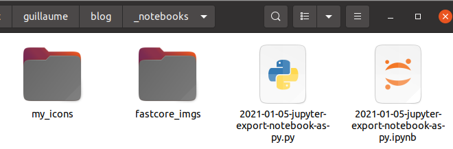

# Auto-convert Jupyter Notebooks To Posts

[`fastpages`](https://github.com/fastai/fastpages) will automatically convert [Jupyter](https://jupyter.org/) Notebooks saved into this directory as blog posts!

You must save your notebook with the naming convention `YYYY-MM-DD-*.ipynb`.  Examples of valid filenames are:

```shell
2020-01-28-My-First-Post.ipynb
2012-09-12-how-to-write-a-blog.ipynb
2020-12-13-from-cron-to-anacron.ipynb
```

If you fail to name your file correctly, `fastpages` will automatically attempt to fix the problem by prepending the last modified date of your notebook. However, it is recommended that you name your files properly yourself for more transparency.

See [Writing Blog Posts With Jupyter](https://github.com/fastai/fastpages#writing-blog-posts-with-jupyter) for more details.

# Mon process de publication

### Ecrire

Aller sous **_notebooks**.

Créer un nouveau notebook avec le nommage standard: `YYYY-MM-DD-<titre abrege>.ipynb`

Entrer dans la 1ere cellule le format suivant

```markdown
# "<le titre détaillé>"
> "le sous-titre"
- show_tags: true
- toc: true
- branch: master
- badges: false
- comments: true
- categories: [<la liste de tags séparés par une virgule: e.g. ubuntu, cron]
```

Saisir l'article

### Publier

Publier en appelant: `~/git/guillaume/blog/publish.sh`

### Inserer une image

```markdown
 
```

### Inserer un lien

```markdown
[text](https://<url>)
```

###  Insérer une note

```
<div class="alert alert-info">Note<p>when the 2 differs, boom!</p></div>
```


### Notation mathématiques


**Lettres grecques**

```markdown
$$\alpha$$
$$\epsilon$$
```

$$\alpha$$ $$\epsilon$$

**Exposants, indices**

```markdown
E=MC<sup>2</sup>
Q(S<sub>t</sub>, A<sub>t</sub>)
```

E=MC<sup>2</sup>
Q(S<sub>t</sub>, A<sub>t</sub>)