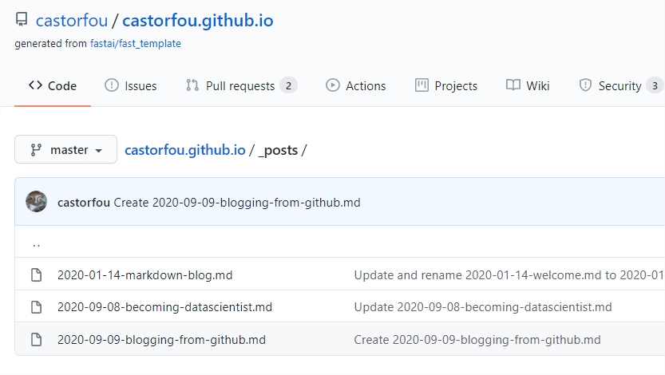

# Blogging from github

## fastai and fastpages
I am a big fan of [fastai](https://www.fast.ai/)'s spirit and even more of their leaders: 
- [Jeremy Howards](https://www.fast.ai/about/#jeremy)
- [Rachel Thomas](https://www.fast.ai/about/#rachel)
- [Sylvain Gugger](https://www.fast.ai/about/#sylvain) who is know at huggingface.

They are commited to beautiful ideas, and are inspiring people.
I like their courses. I like their softwares. For sure I will discuss about fastai.
They have created fastpages. It turns github into a blogging platform. I don't have the full detail but it is explained in [fastpages github repo](https://github.com/fastai/fastpages)
It is based on github actions, and by just creating a repo from a fastpages template [https://github.com/fastai/fast_template/generate](https://github.com/fastai/fast_template/generate) and giving a couple of settings, you are [ready to go](https://github.com/fastai/fastpages#setup-instructions).

And here I have to thank [Hamel Husain](https://twitter.com/hamelhusain). He is from github company and I think he is behing github actions and helped fastai to release fastpages. I don't know Hamel but he looks like a humble, terribly skilled guy, with tons of energy. Thanks Hamel.

## my blog
My main audience is the future me. (maybe not entirely true otherwise I would have written in French)
In 1 year, I want to turn back to this blog and I would like to see all the learning peaces I went through.
I want this platform to be as easy as possible.

### fastpages
For the moment it cannot be easier. I have setup the `about` page. And each blog entry is just a new markdown page into `_posts`.
github _posts:

By commiting this page, there are internal actions being run automatically (through github actions magic) and after a couple of minutes the new blog pages are generated (using Jekyl and ruby if I am not wrong).
For the moment I use github web interface. But I guess it is easier to have a local repo of my blog, create new entries and when satisfied git push to github. (to be tested later)

### github accounts
For a reason I used my personal github account (guillaume.ramelet@gmail.com) and not my professional one (guillaume.ramelet@michelin.com).
I will see later if I have to move to another account. I had some troubles to setup actions into github. For a reason I thought it was available only for organization account. So I have turned my michelin github account to an organization, and I cannot login anymore. To be fixed later.

### markdown
Ok I am not a huge fan of markdown.
I use it as a basic text system specially within notebooks.
But it is not as easy to insert images. Currently I screenshot what I want to share, insert into `images` folder of my repo and reference this image from my blog post using markdown language.
I definitely have to improve my practice of markdown, and there are multiple [cheatsheets](https://github.com/adam-p/markdown-here/wiki/Markdown-Cheatsheet) to be used.

### jupyter
There are options within fastpages to blog from jupyter notebooks. I have to do it.
My intent will be to use this place to share my knowledge. Today most of my knowledge comes from experiences I make within jupyter. If I could directly blog from that it will be great.

### comments
OK as the sole reader this is maybe a minor concern but there is no commenting system associated with fastpages. I cannot get any feedback from these entries. Would love to get advices, create discussions within that blog. Not for today.
