From [http://introtodeeplearning.com/](http://introtodeeplearning.com/)

I keep all content (lectures, notebooks) in [github](https://github.com/castorfou/mit_6s191)

This is done with google contribution, and therefore all examples are in tensorflow. I will try to adapt notebooks in PyTorch.


## 2/5/21 - Intro to Deep Learning - lecture 1

Lecturer: Alexander Amini

Intro is just jaw-dropping!

[2020 intro](https://youtu.be/5tvmMX8r_OM?list=PLtBw6njQRU-rwp5__7C0oIVt26ZgjG9NI&t=40) was top. 

[2021 intro](https://youtu.be/5tvmMX8r_OM?list=PLtBw6njQRU-rwp5__7C0oIVt26ZgjG9NI&t=149) is just awesome. 

It is a standard overview of simple deep learning concepts: Perceptron, multi-perceptron, dense layers, loss, gradient-descent, backprop, SGD, regularization, dropout, early stoppping


## 2/15/21 - Deep Sequence Modeling - lecture 2

New lecturer: Ava Soleimany

Nice introduction to sequence modeling with Many-to-One, One-to-Many, Many-to-Many.

RNN and implementation in TensorFlow. And NLP examples: next word problem. (and NLP concepts such as Vocabulary, Indexing, Embedding)

And what we need for sequence modeling:

* handle variable-length sequences
* track long-term dependencies
* maintain information about order
* share parameters across the sequence

Backpropagation through time and problem of exploding/vanishing gradients.

Against exploding: gradient clipping. Against vanishing: 3 ways explained - activation functions, weight init, network arch.

Gated cell: to control what information is passed through. Ex: LSTM Long Short Term Memory. They support something closed to Forget Store Update Output. Ava explains graphically which part of LSTM cells is providing which function.

And then examples: Music generation (to generate 4th movement of last symphony from Schubert!), sentiment classification, machine translation (with Attention mechanisms which provide learnable memory access to solve Not long memory), trajectory prediction, environmental modeling.


## 2/16/21 - Intro to TensorFlow;  Music Generation - software lab 1


As an exercise I have completed labs in TensorFlow and adapted them in [PyTorch](https://github.com/castorfou/mit_6s191/blob/main/introtodeeplearning/lab1/Part1_TensorFlow_transposed%20to%20PyTorch.ipynb).

With LSTM, I ran into this error: ```UnknownError: Fail to find the dnn implementation. [Op:CudnnRNN]```

Which is solved by calling [`tf.config.experimental.set_memory_growth`](https://www.tensorflow.org/api_docs/python/tf/config/experimental/set_memory_growth). 

```python
import tensorflow as tf 
gpus = tf.config.list_physical_devices('GPU')
if gpus:
  try:
    # Currently, memory growth needs to be the same across GPUs
    for gpu in gpus:
      tf.config.experimental.set_memory_growth(gpu, True)
    logical_gpus = tf.config.experimental.list_logical_devices('GPU')
    print(len(gpus), "Physical GPUs,", len(logical_gpus), "Logical GPUs")
  except RuntimeError as e:
    # Memory growth must be set before GPUs have been initialized
    print(e)
```

Music lab is nice to play with. I am not sure I would be able to convert to PyTorch. It would require time!

## 2/22/21 - Deep Computer Vision - lecture 3

I have never been a big fan of computer vision.

I like the idea developed by Alexander Amini about **hierarchy of features**. (low level: edges, spots; mid level: eyes, noses)

And how he explains limitation of FC layers for visual detection, and introduction of spatial structure (feature extraction with convolutions)

Some nice examples of hand-engineered convolution filters for different needs: sharpen, edge detect, strong edge detect.

Then classic explanations of CNN with convolution, max pooling.

I like the way classification problems are broken down between feature learning (convolution+relu, pooling, repeated several times) and classification (flatten, FC, softmax) which is a task learning part.

The second part (task learning part) can be anything: classification, object detection, segmentation, probabilistic control, ...


Nice explanation of R-CNN to learn region proposals.

Introduction to Software lab2: de-biaising facial recognition systems. 


## 3/1/21 - Deep Generative Modeling - lecture 4

From pattern discovered from data (underlying structure of the data), generate examples following these patterns.

**Autoencoder**: foundational generative model which builds up latent variable representation by self-encoding the input. To train such network, we create a decoder to go from latent variable to generated output, and then compare input to generated output.

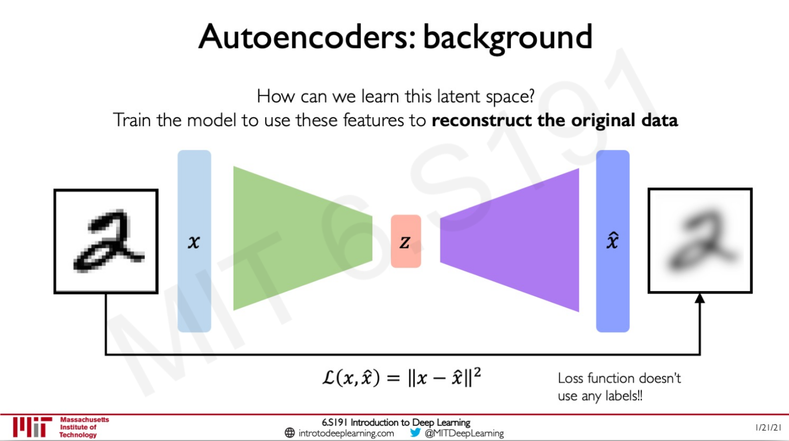


**Variational autoencoder (vae)**: with vae we try to encode inputs as distributions defined by mean $$\mu$$ and variance $$\sigma$$. And we want to achieve continuity and completeness:

- continuity: points that are close in latent space --> similar content after decoding
- completeness: sampling from latent space --> 'meaningful' content after decoding

Regularization is pushing to get these properties.

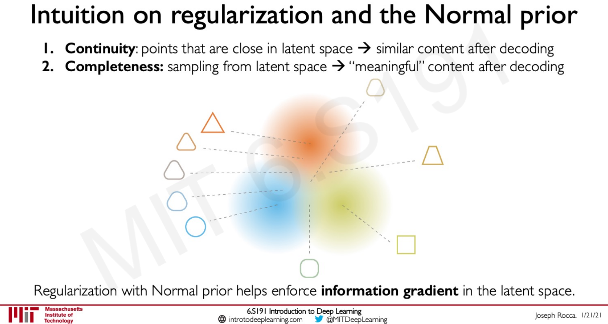

And the learning process is about minimizing reconstruction loss + a regularization term:

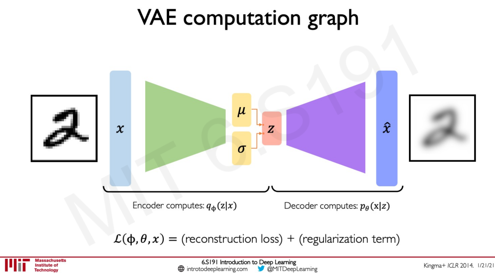

Ava is then explaining the smart trick to allow backpropagation to happen. Indeed by introducing stochastic term in the sampling layer, we are breaking the backpropagation logic.

We are moving z from a normal distribution to $$\mu$$+$$\sigma$$.$$\epsilon$$ where $$\epsilon$$ follow a normal distribution of mean 0, std 1.

Explanation then of space disentanglement via $$\beta$$-VAEs. It allows latent variables to be independent.

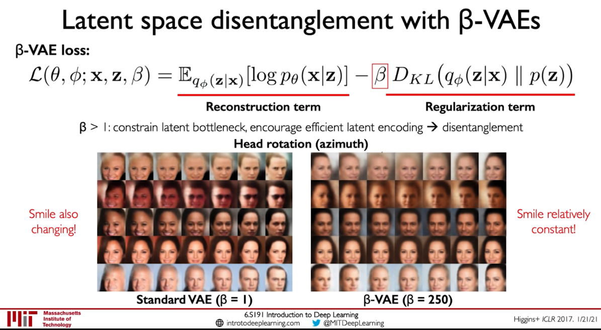


And then some introduction about **GANs* (Generative Adversarial Network) which are a way to make a generative model by having 2 neural networks (generator and discriminator) compete with each other.

And share some recent advances on GAN such as StyleGAN(2), conditional GAN, CycleGAN. CycleGAN is famous for turning horses in zebras, but it can be used to transform speech as well (used in the synthesis of Obama's voice)

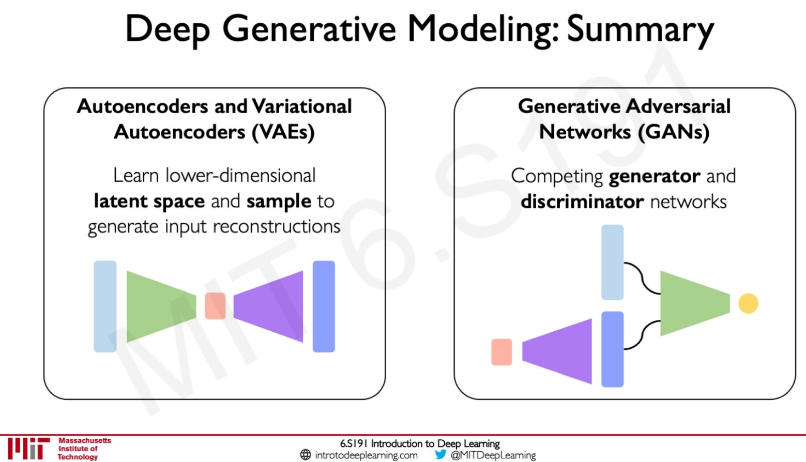


## 3/1/21 - De-biasing Facial Recognition Systems - Software Lab 2

[Part 1 MNIST](https://github.com/castorfou/mit_6s191/blob/main/introtodeeplearning/lab2/Part1_MNIST.ipynb)

starts with FC layers. With some overfitting but a good accuracy of 96%.

then move to a CNN architecture. I ran into [gpu issues](https://github.com/tensorflow/tensorflow/issues/24828).  Accuracy is now 99%.

I didn't manage to make the last part working. (using tape.gradient)

[Part 2 Debiasing](https://github.com/castorfou/mit_6s191/blob/main/introtodeeplearning/lab2/Part2_Debiasing.ipynb)

Fit a CNN model to classify faces based on celebA dataset. And see the bias effect by predicting on Fitzpatrick scale skin type classification system.

Use VAE to learn latent structure.


To then debias using DB-VAE model.


There is a lack of progressive unit tests to validate each step. Cannot go to the end.

Would be interested to see how to apply to non computer vision problems.


## 3/8/21 - Deep Reinforcement Learning - lecture 5

Q-function captures the expected total future reward an agent in state *s* can receive by executing a certain action *a*.

Distinction between **Value Learning** (learn Q function) and **Policy Learning** (find directly $$\pi$$(s)).

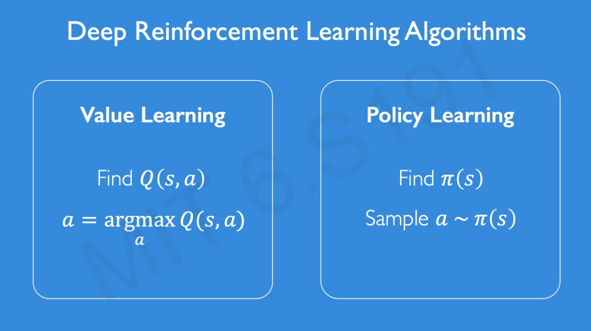


**Value Learning or DQN**

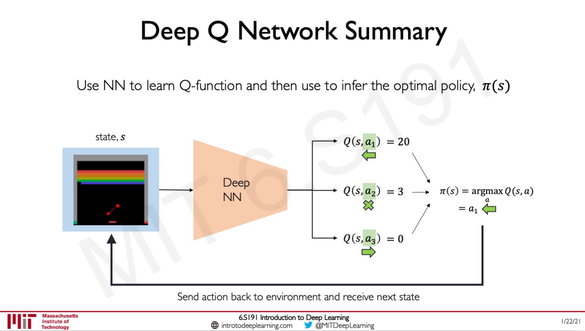

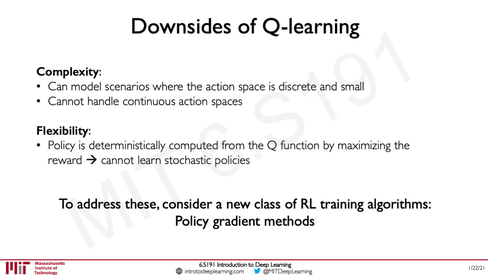

The key thing is about handling of continuous actions.

Let's see how to do it with policy learning:

**Policy learning or Policy Gradient (PG)**

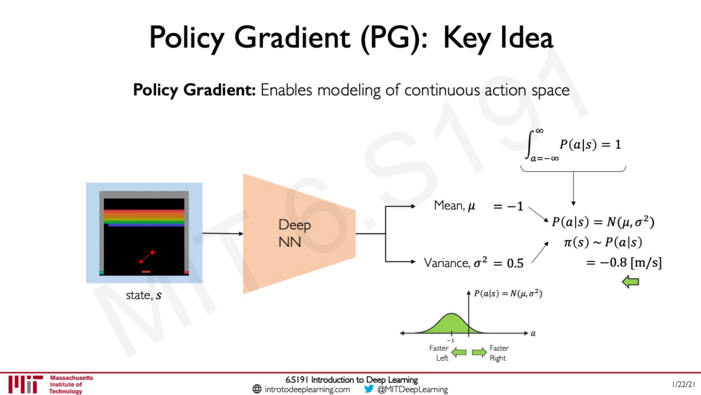

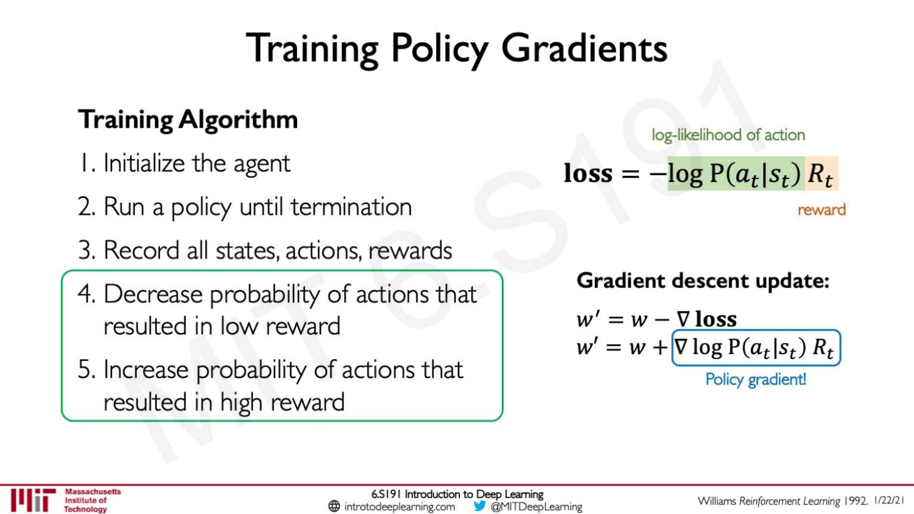

Alexanders ends the lecture by discussing about Deepmind progress:

- alphaGo - 2016: with a pretrain in supervised mode then standard DRL
- alphaGo Zero - 2017: standard DRL without pretraining
- alphaZero - 2018: standard DRL without pretraining and applied to several games (Go, Chess, Shogi)
- MuZero - 2020: learns the rules of the game by itself, create unknown dynamics


## 3/15/21 - Limitations and New Frontiers - lecture 6

**Universal Approximation Theorem**: A feedforward network with a single layer is sufficient to approximate, to an arbitrary precision, any continuous function.

Ava emphasizes importance of training data (e.g. for generalization) and mentions a paper called "[Understanding Deep Neural Networks Requires Rethinking Generalization](https://arxiv.org/abs/1611.03530)".

Some fail examples with dogs colorization (BW -> colors) creating pink zone under the mouth.

And another one with Tesla autopilot. It motivates working on **uncertainty in Deep Learning**.

* we need uncertainty metrics to assess the noise inherent to the data: *aleatoric uncertainty*
* we need uncertainty metrics to assess the network's confidence in its predictions: *epistemic uncertainty*

Ava cites an example of a real 3D printed turtle designed to fool a classifier from turtle to rifle.

**New frontier: Encoding Structure into Deep Learning.**

CNN is a nice way to extract features from an image. But not all kind of data can express features in an euclidean way. Graphs is used as a structure for representing data in a lot of cases.

It drives us to **Graph Convolutional Networks** (GCNs). The graph convolutional operator is going to associate weights with each of the edges and apply the weights across the graph and then the kernel is going to be moved to the next node in the graph extracting information about its local connectivity. That local information is going to be aggregated and the NN is going to then learn a function that encodes that local information into a higher level representation.

**New frontier: Automated Machine Learning & AI.**

Using a neural architecture search algorithm. At each step the model samples a brand new network. For each layer, defines number of fileters, filet height, width, stride height, width, nbr of fileters, etc. Update RNN controller based on the accuracy of the child network after training.

From autoML to autoAI: an automated complete pipeline for designing and deploying ML and AI models.

## 3/15/21 - Pixels-to-Control Learning - Software Lab 3

This is about reinforcement learning.


We install (apt) xvfb and python-opengl.

And will learn with cartpole and pong.

Still this issue 

>UnknownError:  Failed to get convolution algorithm. This is probably because cuDNN failed to initialize, so try looking to see if a warning log message was printed above.
>	 [[node sequential_8/conv2d_4/Conv2D (defined at <ipython-input-21-f109a85f869a>:19) ]] [Op:__inference_distributed_function_2442603]

Solved by running 

```python
import tensorflow as tf
gpus = tf.config.list_physical_devices('GPU')
if gpus:
    try:
        # Currently, memory growth needs to be the same across GPUs
        for gpu in gpus:
            tf.config.experimental.set_memory_growth(gpu, True)
        logical_gpus = tf.config.experimental.list_logical_devices('GPU')
        print(len(gpus), "Physical GPUs,", len(logical_gpus), "Logical GPUs")
    except RuntimeError as e:
        # Memory growth must be set before GPUs have been initialized
        print(e)
```

I couldn't go through the training of Pong agent due to GPU limitation?

```bash
2021-03-15 10:54:19.479775: W tensorflow/core/framework/op_kernel.cc:1655] OP_REQUIRES failed at conv_grad_input_ops.cc:1254 : Resource exhausted: OOM when allocating tensor with shape[3944,48,10,10] and type float on /job:localhost/replica:0/task:0/device:GPU:0 by allocator GPU_0_bfcbash
```


## 3/22/21 - Evidential Deep Learning and Uncertainty - lecture 7

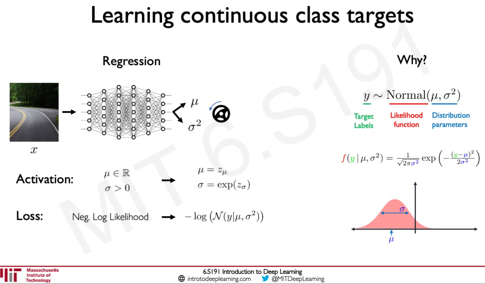

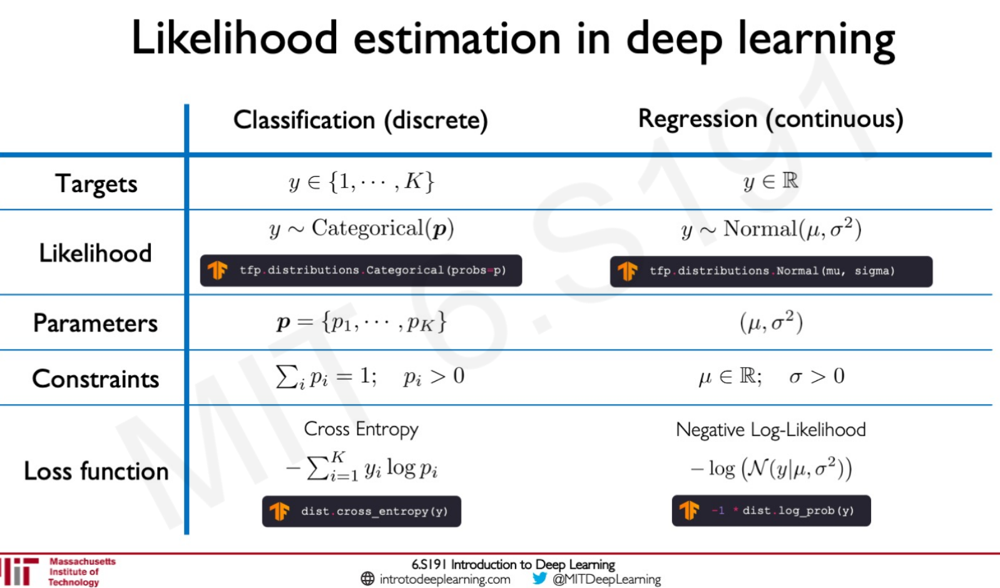


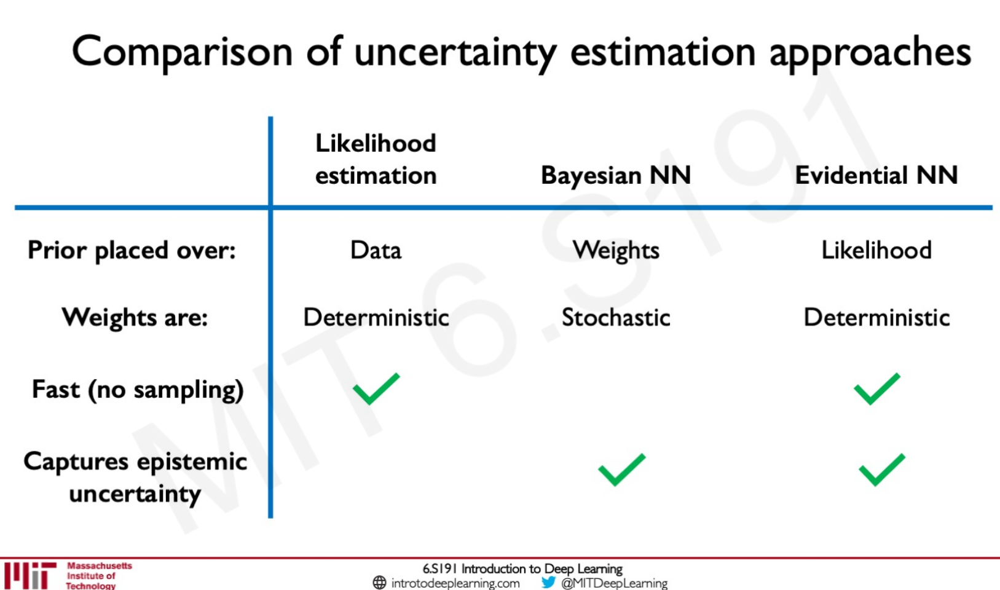


## 3/29/21 - Bias and Fairness - lecture 8

This starts as a standard lecture about bias. 

I like emphasis about bias that could stand in all stages of AI life cycle:

* data (obviously)
* model
* training and deployment
* evaluation
* interpretation

Good explanation about biases due to **class imbalance**. It develops my intuition about it.

**Balanced batches** can be the answer.

**Example weighting** is another option using inverse frequency as a weight.

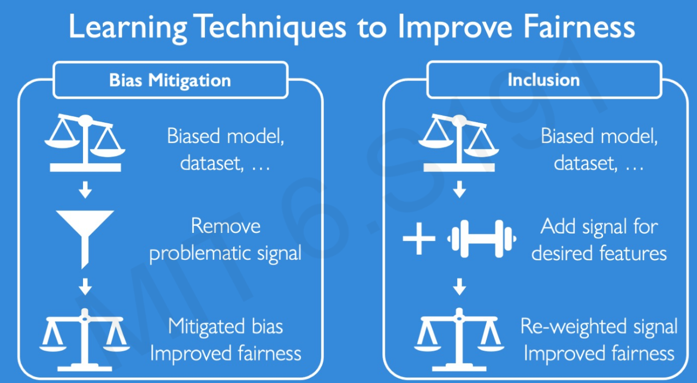

Adversarial learning to mitiage Bias.

Application in NLP to complete analogies. He is to she, as doctor is to ?

Same thing with Learned Latent Structure. (can be used to create fair and representative dataset)


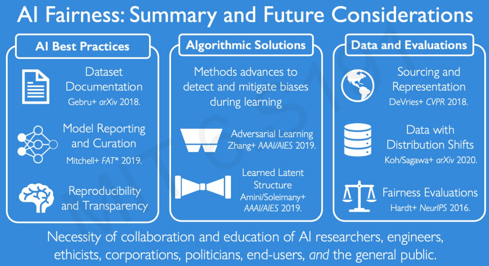


## 4/15/21 - Learning for Information Extraction - lecture 9.

[Deep CPCFG for Information Extraction ](https://www.youtube.com/watch?v=WkUYsVC3hKI&list=PLtBw6njQRU-rwp5__7C0oIVt26ZgjG9NI&index=9)

Lecturer: Nigel Duffy and Freddy Chua, Ernst & Young AI Labs

Focus is about document intelligence (extract info from business documents)

e.g. extract information from semi-structured documents such as tax forms (souvenirs ;))

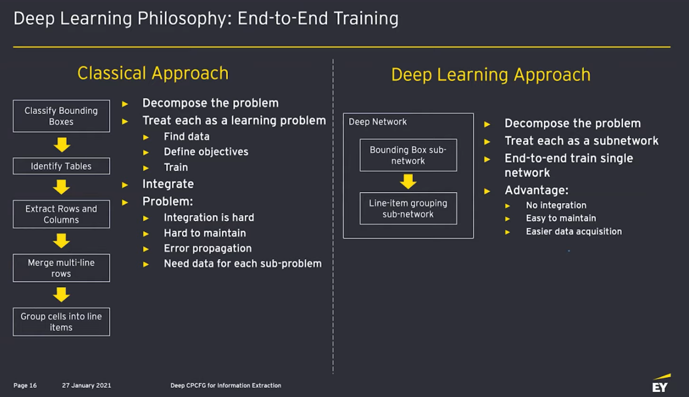


## 4/27/21 - Taming Dataset Bias - lecture 10

[video](https://www.youtube.com/watch?v=eS-OHAHOqU0&list=PLtBw6njQRU-rwp5__7C0oIVt26ZgjG9NI&index=11)

dataset bias and training shift 

(from one city to another (summer vs winter), from simulated to real control, from one culture to another)

Can fix with more data ...(can be very expensive if we want to address all combinations) or use unlabeled data ?

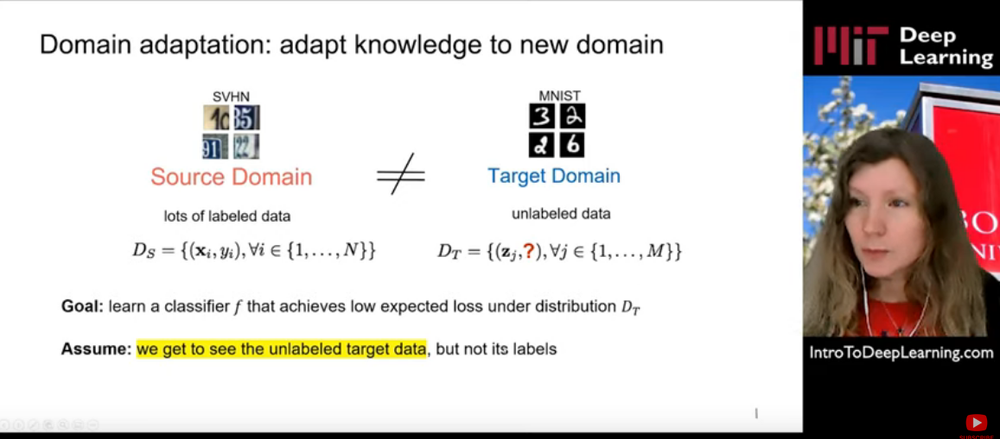

Adversarial approach to fool a domain discriminator. (domain discriminator trained to distinguished source and target domains)

Another approach is pixel alignment.

## 4/30/21 -  Towards AI for 3D Content Creation - lecture 11

[video](https://www.youtube.com/watch?v=lkkFcg9k9ho&list=PLtBw6njQRU-rwp5__7C0oIVt26ZgjG9NI&index=12)

##### Sanja Fidler; Professor U. of Toronto and Head of AI at NVIDIA


## 4/30/21 -  AI in Healthcare - lecture 12

[video](https://www.youtube.com/watch?v=cvXVK8oqU4Q&list=PLtBw6njQRU-rwp5__7C0oIVt26ZgjG9NI&index=13)

##### Katherine Chou; Director of Research and Innovations, Google

