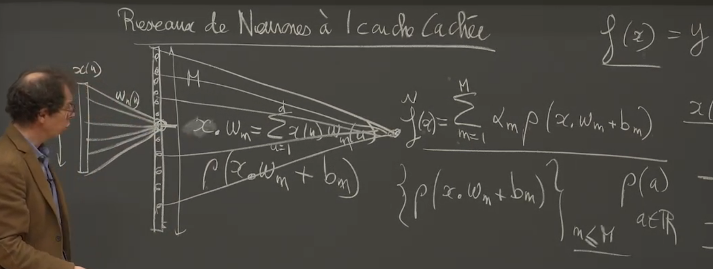
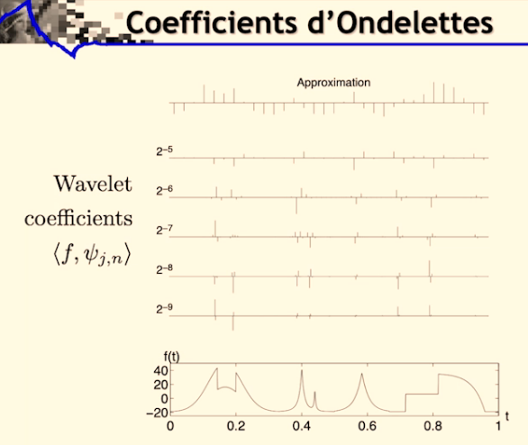
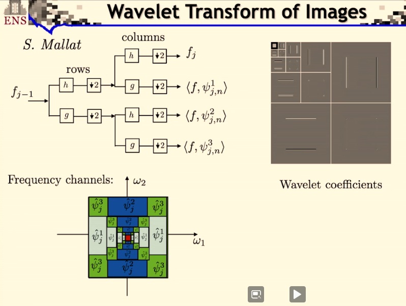

Un exposé en 8 cours au collège de France de Stéphane Mallat sur les [représentations parcimonieuses - 2021](https://www.college-de-france.fr/site/stephane-mallat/course-2020-2021.htm).

Cela donne envie d'aller voir ses autres cours:

* [2018](https://www.college-de-france.fr/site/stephane-mallat/course-2017-2018.htm): L'apprentissage face à la malédiction de la grande dimension
* [2019](https://www.college-de-france.fr/site/stephane-mallat/course-2018-2019.htm): L'apprentissage par réseaux de neurones profonds
* [2020](https://www.college-de-france.fr/site/stephane-mallat/course-2019-2020.htm): Modèles multi-échelles et réseaux de neurones convolutifs

A peu près 16 vidéos de 1h30 par cours. Et des notes de cours en pdf.

## 2/15/21 - Le triangle « Régularité, Approximation, Parcimonie » (lecture 1)

C'est l'introduction du cours. J'apprécie les références historiques et philosphiques partant du rasoir d'Ockam. C'est le principe d'économie ou de parcimonie: le beau, le vrai viendrait du simple.

La 1ere fois que j'entends une référence précise sur l'opposition entre biais (erreur sur modèle) et variance (erreur sur données ou mesures)

Et une invitation à consulter une [méthodologie d'analyse de données](https://www.college-de-france.fr/site/stephane-mallat/seminar-2018-02-21-11h15.htm) par Pierre Courtiol en utilisant Kaggle. L'idée d'une approche simple linéaire pour bien comprendre quelles étapes successives à emprunter pour améliorer son approche. Me semble assez orthogonal à ce que peut proposer Jeremy Howard: commencer tôt, overfitting n'est pas un probleme, pas de early stopping, etc.

## 2/10/21 - Approximations linéaires et analyse de Fourier (lecture 2)

J'ai commencé par ce cours conseillé par Rémi mon pote enseignant chercheur en math. C'est un peu le grand écart avec des méthodes d'enseignement anglo-saxonnes mais ça fait du bien. C'est finalement plus proche de ce que j'ai connu dans ma formation initiale.

S.Mallat présente les équivalences (sous certaines conditions) entre 

* Régularité
* Approximation en basse dimension
* et représentation parcimonieuse

dans le cadre des approximations linéaires. Il parle des 2 mondes: traitement du signal et analyse de la donnée. Je suis moins intéressé par le 1er monde, mais j'apprécie la piqure de rappel. Je ne me rappelais pas du tout l'importance de l'analyse de Fourier et la construction des bases de L[0,1] par exemple.

Et il revient sur les singularités, beaucoup d'informations sont portées par les singularités (par exemple les frontières dans une image)

Je crois bien que je vais me faire toute la session, et sans doute les autres années.

## 2/23/21 - Grande dimension et composantes principales (lecture 3)

Dans ce cadre linéaire grande dimension, quelle meilleure base - approche PCA et base Karhunen-Loeve.

Quid quand on passe en non linéaire.

Réseau neurone à 1 couche cachée, théoreme de representation universel.

Retour sur les bases de L²[0,1] qui sont les bases de Fourier en variables complexes. 

Pour un passage en dimension q, on remplace n par (n1, ..., nq) et la multiplication n*u par le produit scalaire <n, u>.

En travaillant sur les équivalences du triangle, il montre pourquoi on est très limité en approximation lineaire quand la dimension augmente.

En approximation lineaire, il suffit de prendre les 1ers vecteurs (se limiter à une dimension q) (en base de fourier par exemple) pour avoir une assez bonne approximation. Dans des signaux plus perturbés (avec des singularités) on perd plus d'énergie: il faudrait échantilloner plus fin dans ces zones de singularités et si on dispose d'une base orthonormée il s'agirait non plus de prendre les q 1ers vecteurs mais de prendre ceux d'intéret.

## 3/2/21 - Approximations non linéaires et réseaux de neurones (lecture 4)

Le triangle (approximation basse dimensions, représentation parcimonieuse, régularité) d'un point de vue non linéaire.

Ici plutôt qu'approximer un signal en prenant les M 1ers coefficients de Fourier (basses dimensions), on va prendre M coefficients mais dépendamment de x. C'est ici qu'on introduit la non-linéarité. L'erreur est alors la queue de distribution des coefficients ordonnés. On veut que l'énergie des plus petits coefficients soit négligeable.

Pas facile d'obtenir cet ordre, on cherche une façon de limiter les coefficients non ordonnés nous donnant une représentation parcimonieuse. En utilisant la nome l$\alpha$ avec $$\alpha$$ petit (inférieur à 2 et proche de 0), on introduit cette décroissance mais cette fois-ci sur les coefficients non ordonnés.

Intéressant d'avoir des normes convexes, et dans ce cas on ne peut prendre que $$\alpha$$=1. C'est pour ça qu'on voit apparaître partout les normes l1 dans les algorithmes d'apprentissage (norme convexe garantissant une forme de sparsité).

On passe aux réseaux de neurones à 1 couche cachée. Et on va basculer dans les notations de x(u) à f(x)., avec x $$\epsilon$$ [0, 1]d.

Ici on projette f dans l'espace engendré par ces vecteurs { $$\rho$$(x.wm+bm) }n<=M.

On peut facilement calculer l'erreur quadratique comme l'intégrale sur les x $$\epsilon$$ [0, 1]d de la norme l² ( f(x)-ftilde(x) ) et il y a un belle démonstration qui est le **théorème d'approximation universelle** (démontrée entre 1988 et 1992) qui montre que l'erreur tend vers 0 quand M tend vers l'infini.

La démonstration avec $$\rho$$ = eia revient à une décomposition d'en Fourier. Et pour d'autres non régularité comme reLu ou sigmoid, il s'agit d'un changement de base.

Et là on arrive à la malédiction de la dimensionnalité car quand d est grand (disons 1M), les coefficients baissent à une faible vitesse. Que faut-il faire pour battre cette malédiction?

Baron en 1993 introduit une hypothèse de regularité qui permet de borner l'erreur par un terme qui ne dépend pas de la dimension. C'est donc gagné sauf que l'hypothèse de régularité n'est généralement pas valide dans les cas qui nous intéressent.

Stéphane Mallat, de façon brillante mais est-ce étonnant, explique pourquoi l'approche des mathématiciens est une impasse et pourquoi ce qu'on cherche à faire se ramène à un problème bayésien. Car les problèmes qui nous intéressent (par exemple la classification d'objets, ne va solliciter qu'un minuscule espace (même si de grande dimension) parmi toutes les images possibles). On va donc chercher à caractériser x pour chaque y (classe). (revoir vidéo entre 49' et 1h03) 

L'enjeu est de caractériser le support qui est beaucoup plus concentré que [0,1]d.

Donc on va retravailler sur les approximations non linéaires de x, le signal lui-même (et non plus f), et d'essayer de comprendre pourquoi on peut faire beaucoup mieux que la transformée de Fourier et quelle genre de bases vont nous permettre de faire bcp mieux. Une des applications va être la compression, qui va nous amener à étudier la théorie de l'information et la théorie de l'information c'est exactement la théorie probabiliste qui explique ces phénomènes de concentration et les mesure avec l'entropie.

Introduction des bases d'ondelettes qui vont permettre de représenter les singularités locales. Les ondelettes sont à la fois localisées (paramètre v) et dilatées (paramètre s). Il faudra à partir de ces ondelettes construire des bases orthogonales pour arriver à des approximations basses dimensions (et garder les grands coefficients)

On introduit la notion de régularité locale exprimée avec lipchitz $$\alpha$$. Avec $$\alpha$$ <1 pour exprimer les singularités. 

## 3/9/21 - Ondelettes et échantillonnage (lecture 5)

On était resté sur une représentation de signaux qui ne présentent pas de régularité uniforme mais qui présentent des singularités que nous voulons capter, ces singularités étant porteuses d'informations importantes (par exemple les contours dans une image). Ces singularités n'étant pas très nombreuses, on peut toujours parler de **régularité locale**.

On va donc utiliser des ondelettes pour décomposer ces signaux, d'où la notion de **représentation parcimonieuse**, exprimée sur la base d'ondelettes orthonormales. Et enfin en en sélectionnant un petit nombre nous revenons sur nos **approximations en basse dimension**.

Le produit scalaire du signal x(u) par l'ondelette $$\psi$$v,s revient à un produit de convolution de x par l'ondelette conjuguée. Ca veut dire que sur les points de singularités les produits scalaires vont être maximisés.

Stéphane Mallat passe un long moment pour nous amener à la construction de ces bases d'ondelettes orthonormales. Il part des bases de Haar puis de Shannon et arrive à une construction plus récente par Yves Meyer en 1986.

## 3/16/21 - Multi-résolutions (lecture 6)

 On a vu la dernière fois qu'on pouvait construire une base d'ondelette le long des indices de dilatations en 2j. 

On va voir maintenant qu'on peut translater les ondelettes par des facteurs 2j.n.

Donc quand j est grand, les échelles sont de plus en plus grande. Et j petit va amener un échantillonnage  de plus en plus fin.

$$
\left\{ \Psi_{(j,n)}(u)=\frac{1}{\sqrt{2^j}}\Psi \left( \frac{u-2^jn}{2^j} \right) \right\}_{(j, n) \epsilon \Z^2}
$$

sont-elles des bases orthonormales. Ensuite on appliquerait les techniques d'approximations consistant à éliminer les petits coefficients.

Les multi-résolutions sont des espaces linéaires sur lesquels nous allons projeter ces signaux. On va chercher à réduire les dimensions (par ex d'une image) en projetant sur ces espaces emboîtés. Et conserver le maximum d'information.

Un produit scalaire avec une fonction translatée peut toujours s'écrire comme un produit de convolution (Stéphane Mallat répète souvent cette propriété)

Stéphane Mallat fait ensuite le lien avec les algorithmes en bancs de filtre (cascades de filtrage + échantillonnage).

Dans ces opérations il y a sans arrêt des passages du continu au discret. Par exemple si je prends un signal et que je le projette sur ces espaces je me retrouve avec les coordonnées, qui sont les produits scalaires avec mes $$\phi$$j,n (car base orthogonale), ce qui revient à filtrer et sous échantillonner.

## 3/23/21 - Bases orthonormales d'ondelettes (lecture 7)

On repart sur notre triangle. Depuis 2 cours on est sur l'approximation basse dimension.

Stéphane Mallat applique le théorème sur des cas particuliers de la base de Haar, puis de la base de Shannon. Et revient sur la construction d'une base orthonormales avec des ondelettes "optimales".

Quand on prend le produit scalaire de notre signal f avec les ondelettes, on obtient des résultats presque nuls lorsque le signal est régulier. Et plus on a de moments nuls avec nos ondelettes, plus la régularité est ignorée (l'approximation par projection sur un espace vectorielle des monômes à l'ordre n).

On va cascader les projections aj (et les détails dj), et ça va revenir à cascader les filtres (les coefficients et les ondelettes).

Pour cela on calcule les valeurs des aj et dj en fonction de aj-1. On montre que cela s'obtient en filtrant (respectivement avec les $$\overline{h}$$ et $$\overline{g}$$) puis en sous-échantillonnant. En cascadant on obtient une série de filtrages, sous-échantillonnages, filtrages, sous-échantillonnages, , etc.

Les filtrages sont des convolutions. Si h a un support compact, ça va réduire le temps de calcul.(le nombre d'éléments non nuls correspond à la taille du filtre). Le nombre d'opérations pour passer de aL à aL-1, dL-1 est N*2m (où N: nombre de coefficients de aL et m est le nombre de moments nuls)

Le nombre d'opérations est linéaire, et la constante correspond à la taille des filtres.

On peut inverser cet algorithmes (car base o.n.) et la structure emboîtée va nous donner algorithme de reconstruction. On va sur-échantillonner (augmenter d'un facteur 2 en intercalant des 0) et appliquer les filtres g et h, et sommer pour obtenir le résultat.

Donc en gardant la base fréquence aJ et tous les détails {dj}, on reconstitue aL. (les signaux sur des grilles de plus en plus fines)

Stéphane Mallat finit sur des exemples en 2 dimensions. En 2 dimensions on aura 3 ondelettes à chaque échelle (1 avec les hautes fréquences dans une direction, 1 avec les hautes fréquences dans l'autre direction, et la dernière avec haute fréquence sur les 2 directions (les coins)). 

## 3/30/21 - Parcimonie et compression d'images (lecture 8)

Stéphane Mallat propose un survol de tout le cours pour montrer la logique dans laquelle on a évolué.

En reprenant le triangle Régularité - Approximation en basse dimension (au cœur du traitement de donnée) - Représentation parcimonieuse. Les équivalences entre régularité et la construction de représentations parcimonieuses permettent de construire des approximations en basse dimension.

Mais on peut les interpréter différemment :

* d'un point de vue linéaire : on peut construire des approximations linéaires qui vont correspondre à des formes de régularité et certains types de représentations parcimonieuses (en particulier dans la base de Fourrier quand on a des invariants par translation)
* en prenant un point de vue non linéaire : qui consiste non pas à faire des projections dans des espaces linéaires mais plutôt des projections dans des unions d'espaces linéaires obtenus en sélectionnant de façon libre dans une base orthogonale les plans les plus représentatifs.

Il reprend en détail ce qu'on a vu en repartant de la théorie développée par Fourier (1822 ça ne date pas d'hier). Et reprend les réseaux de neurones à 1 couche cachée. 

$$
f_M(x)=\displaystyle\sum_{m}w(m)\rho(\langle{x,w_m}\rangle+b_m)
$$

L'entrée est x en dimension d, dans la première couche on calcule des produits scalaires avec les vecteurs $v_m$ qui sont les colonnes d'un opérateur linéaire $W_1$ et ces M produits scalaires vont être regroupés avec un relu (ou toute autre non-régularité) et un biais, et dans la dernière couche on fait une combinaison linéaire pour construire l'approximation. M est le nombre d'éléments dans la couche cachée, peut-on bien approximer f(x) à partir de cette construction ?

Ces réseaux, en prenant comme non-régularité un cosinus, nous font retomber sur des séries de Fourier. 

$$
f_M(x)=\displaystyle\sum_{\| v_m \|<R}w(m) \cos (\langle{x,w_m}\rangle+b_m)
$$

Faire une décomposition avec un réseau de neurone à 1 couche cachée est très similaire à décomposer la fonction dans une base de Fourier. Prendre un relu consisterait à faire un changement de base entre le relu et le cosinus.

Si on veut approximer une **fonction uniformément régulière**, il va falloir garder les basses fréquences. Mais $x$ n'est pas en dimension 1 mais en dimension $d$. Les fréquences qu'il va falloir prendre ici sont dans $\Z^d$, il va falloir garder toutes les fréquences dans une boule de rayon plus petit que $R$. Mais quand on est en dimension $q$, le nombre d'éléments dans une boule plus petit que $R$ va croître comme $R^q$. Donc il va falloir garder énormément d'éléments.

On a la possibilité d'approximer n'importe quelle fonction dans $L^2$ avec une erreur qui va décroître vers 0 quand le nombre de termes $M$ tend vers $\infty$ parce qu’on a une base orthogonale et donc n'importe quelle fonction peut être représentée à partir de la base

$$
f \in L^2 \implies \lim\limits_{M \to \infty}\| f-f_M \|=0
$$

C'est le théorème d'**approximation universelle**.

Par contre si on a une régularité on peut préciser la vitesse de décroissance de l'erreur et en particulier si ma fonction est $\alpha$ dérivée dans un espace de Sobolev de degré $\alpha$, l'erreur va décroître d'autant plus vite que la régularité est grande, parce que les coefficients de Fourier vont décroître, et la vitesse de décroissance dépend de $\alpha/d$.

$$
f \in H^\alpha \implies \|f-f_M\| = o(M^{-\alpha/d})
$$

C'est la **malédiction de la dimensionnalité**.

Une autre approche consiste à reprendre ce cercle d'un **point de vue non-linéaire**. Au lieu de toujours prendre les mêmes coefficients pour approximer les fonctions qui m'intéressent, je vais adapter les coefficients à la fonction. C'est l'esprit des approximations non-linéaires.

Si je considère les vecteurs de Fourier, et ses coefficients ont une norme $L^p$ qui converge, pour un $p<2$. Alors on a vu que les coefficients vont décroître à une vitesse qui dépend de $p$. Ca veut dire qu'il y a quelques grands coefficients et beaucoup de petits. Si on choisit les grands coefficients alors on va avoir une erreur qui décroît comme $-2/(p+1)$, l'erreur décroît lorsque $M$ augmente, indépendamment de la dimension.

$$
Sparse \quad Fourier \quad coefficients: Barron \quad p<2
\\
\displaystyle\sum_{v \in \Z^d} |\langle{f(x), F_v(x)}\rangle|^p < \infty \implies \|f-f_M\|=o(M^{-2/p+1})
$$

**no curse**. Mais résultat tautologique. Pourquoi cette fonction serait approximable avec quelques coefficients de Fourier. Ça n’explique en rien pourquoi on peut améliorer fortement ce résultat en augmentant le nombre de couche. C'est simple mais ça n'explique pas les performances des réseaux de neurones profonds.

D'où l'**approche par ondelettes**.

 Et la nécessité de construire des bases orthogonales d'ondelettes à décroissance rapide. Travaux de Yves Meyer. (en essayant de démontrer que ça n'était pas possible il a réussi à en construire ;)) Et S.Mallat a amélioré cette approche en se basant sur des approches de multi résolutions avec des espaces imbriqués. 

On peut construire ces ondelettes en cascadant des filtres à différentes échelles (passe bas et passe bande à différentes échelles).

I.Daubechies a montré qu'on peut construire des ondelettes à support compact. 

Y.Meyer a montré ce que ça donnait en dimension 2 (et c'est généralisable en dimension q) avec 3 ondelettes.

