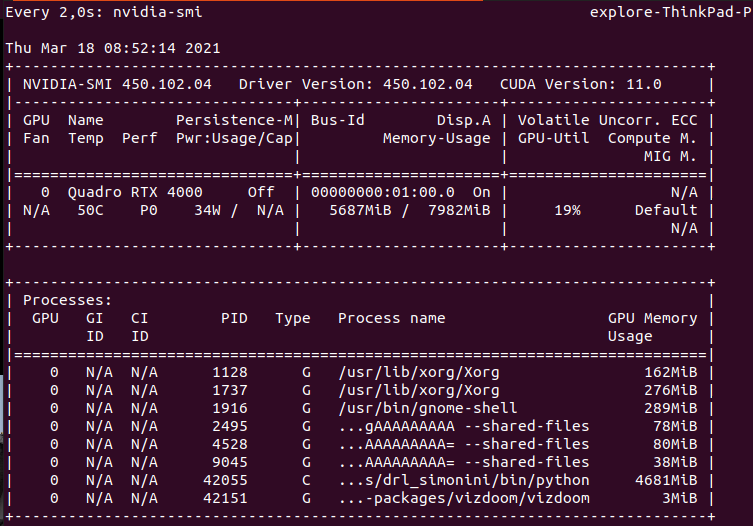

A course by [Thomas Simonini](https://www.simoninithomas.com/)

[Syllabus (from 2018)](https://simoninithomas.github.io/deep-rl-course/) 

[Course introduction (from 2020)](https://medium.com/deep-reinforcement-learning-course/launching-deep-reinforcement-learning-course-v2-0-38fa3c24bcbc) 

Everything available in [github](https://github.com/simoninithomas/Deep_reinforcement_learning_Course)

I appreciate the effort to update examples, and some 2018 implementations became obsolete. Historical Atari VC2600 games are now Starcraft 2 or minecraft, and news series on building AI for video games in Unity and Unreal Engine..


## (2/19/21) - [Chapter 1](https://thomassimonini.medium.com/an-introduction-to-deep-reinforcement-learning-17a565999c0c) - An Introduction to Deep Reinforcement Learning?

Previous version from [2018: What is Deep Reinforcement Learning?](https://medium.freecodecamp.org/an-introduction-to-reinforcement-learning-4339519de419) is quite interesting. With 3 parts:

- What Reinforcement Learning is, and how rewards are the central idea
- The three approaches of Reinforcement Learning
- What the “Deep” in Deep Reinforcement Learning means


Rewards, long-term future reward, discount rate.


Episodic (starting and ending point) vs Continuous (e.g. stock trading) tasks.

Way of learning: Monte Carlo (MC: rewards collected at the end of an episode) vs Temporal Difference (TD: estimate rewards at each step)


Exploration/Exploitation trade off. Will see later different ways to handle that trade-off.


### Three approaches to Reinforcement Learning

These are value-based, policy-based, and model-based.

#### Value Based

In value-based RL, the goal is to optimize the value function *V(s)*.

The value function is a function that tells us the maximum expected future reward the agent will get at each state.


#### Policy Based

In policy-based RL, we want to directly optimize the policy function *π(s)* without using a value function.

The policy is what defines the agent behavior at a given time.

We have two types of policy:

- Deterministic: a policy at a given state will always return the same action.
- Stochastic: output a distribution probability over actions.


#### Model Based

In model-based RL, we model the environment. This means we create a model of the behavior of the environment. Not addressed in this course.

### Deep Reinforcement Learning

In Q-learning, we keep a table of actions to take for each state (based on reward). This can be huge.

Deep Learning allows to approximate this Q function.


[Updated version](https://thomassimonini.medium.com/an-introduction-to-deep-reinforcement-learning-17a565999c0c) from 2020 (and [video](https://www.youtube.com/watch?v=q0BiUn5LiBc) version)

This is a good starting point, well explained.

Reinforcement Learning is just a **computational approach of learning from action.**

**A formal definition**

> Reinforcement learning is a framework for solving control tasks (also called decision problems) by building agents that **learn from the environment** by **interacting with it** through trial and error and **receiving rewards** (positive or negative) **as unique feedback.**

Some explanations about **observations** (partial description) vs **states** (fully observed envt). Only differs in implementation, all theoretical background stays the same.

Action space where we can distinguish **discrete** (e.g. fire, up) actions from **continuous** (e.g. turn 23deg) ones.

**Reward** part is the same as the one from 2018. With cheese, mouse, maze example.

**Episodic** and **continuous** tasks part is the same as the one from 2018.

**Exploration/Exploitation trade-off** is explained the same way + an additional example taken from [berkley - CS 294-112](http://rail.eecs.berkeley.edu/deeprlcourse-fa18/) - Deep Reinforcement Learning course. I want to learn more about this course!

About **solving RL problems**, it is now presented as 2 main approaches:

* **policy-based** methods
* **value-based** methods


And bedore to explain that, nice presentation of what is a **policy $\pi$**. Solving RL problem is to find that optimal policy: directly with policy-based method, indirectly (through value function) with value-based method.

There is an explanation about different types of policy: **deterministic** and **stochastic**.

And that we use deep neural networks to estimate the action to take (policy based) or to estimate the value of a state (value based). Thomas suggests to go further with deep learning with MIT 6.S191, which is the [one](https://castorfou.github.io/guillaume_blog/deep%20learning/mit/tensorflow/2021/02/05/learning-MIT-6.S191-2021.html) (version 2021) I follow these days.


## (2/19/21) - [Chapter 2 - part 1](https://thomassimonini.medium.com/q-learning-lets-create-an-autonomous-taxi-part-1-2-3e8f5e764358) - Q-Learning, let’s create an autonomous Taxi

And in [video](https://www.youtube.com/watch?v=230bR2DrbdE&feature=emb_logo) (I like to read + watch the video at the same time)

Here in Step 2 we focus on a value-based method: Q-learning. And what is seen in part 1 and 2:


#### Value-based method

Remember what we mean in value-based method


you don't train your policy, you define a simple function such as greedy function to select the best association State-Action, so the best action.

#### **Bellman equation**

each value as the sum of the expected return, **which is a long process.** This is equivalent **to the sum of immediate reward + the discounted value of the state that follows.**


#### Monte Carlo vs Temporal Difference

And then an explanation about 2 types of method to learn a policy or a value-function: 

- *Monte Carlo*: learning at the end of the episode. With *Monte Carlo*, we update the value function from a complete episode and so we **use the actual accurate discounted return of this episode.**
- *TD learning*: learning at each step. With *TD learning*, we update the value function from a step, so we replace Gt that we don’t have with **an estimated return called TD target.** (chich is the immediate reward + the discounted value of the next state)


It was not clear to me that these methods could be used for policy-based approach. It is now!


## (2/24/21) - [Chapter 2 - part 2](https://thomassimonini.medium.com/q-learning-lets-create-an-autonomous-taxi-part-2-2-8cbafa19d7f5) - Q-Learning, let’s create an autonomous Taxi

But the video is not yet available.

**What is Q-Learning?**

Q-Learning is an **off-policy value-based method that uses a TD approach to train its action-value function:**

- *“Off-policy”*: we’ll talk about that at the end of this chapter.
- *“Value-based method”*: it means that it finds its optimal policy indirectly by training a  value-function or action-value function that will tell us what’s **the value of each state or each state-action pair.**
- *“Uses a TD approach”*: **updates its action-value function at each step.**

Q stands for quality (quality of action). After training we'll get the optimal Q-function.

When choosing an action, we have to balance between exploration and exploitation with $$\epsilon$$ - greedy:


But at beginning Q table is not trained yet so we have to increase exploitation. It is done with some decreasing $$\epsilon$$.


The Q-learning algorithm is a 4-step process:

* step1: Q-Table init
* step2: Choose action ($$\epsilon$$ - greedy strategy)
* step3: Perform action A<sub>t</sub> and get R<sub>t+1</sub> and S<sub>t+1</sub>
* step4: Update Q(S<sub>t</sub>, A<sub>t</sub>)


Why it is called **off-policy**? Because we don't have the same logic to select action ($$\epsilon$$ - greedy) and update Q (greedy).

With *On-policy:* we use the **same policy for acting and updating.** Sarsa is such an algorithm.


Nice and simple manual example with mouse, cheese in a maze. We run Q-learning and make all calculation by hands.


<todo> </todo>

<div class="alert alert-info">implement with numpy+gym this algorithm should be a nice exercise.</div>

There is an exercise to implement a taxi, within this [notebook](https://colab.research.google.com/gist/simoninithomas/466c81aa1c2a07dd14793240c6d033c5/q-learning-with-taxi-v3.ipynb#scrollTo=20tSdDbxxK_H) at colab google. Taxi V3 is an env from opengym.

## (3/3/21) - back to 2018 - Chapter 3 - Deep Q-learning with Doom

[Article](https://medium.freecodecamp.org/an-introduction-to-deep-q-learning-lets-play-doom-54d02d8017d8), [Notebook](https://github.com/simoninithomas/Deep_reinforcement_learning_Course/blob/master/Deep%20Q%20Learning/Doom/Deep%20Q%20learning%20with%20Doom.ipynb), [Video](https://youtu.be/gCJyVX98KJ4)

We’ll create an agent that learns to play Doom. Doom is a big  environment with a gigantic state space (millions of different states).  Creating and updating a Q-table for that environment would not be  efficient at all.

The best idea in this case is to create a [neural network](http://neuralnetworksanddeeplearning.com/) that will approximate, given a state, the different Q-values for each action.


Addresses pb of temporal limitation: get multiple frames to have sense of motion.

Video is nice because it goes from start and follows closely all steps.

I wil try to implement in my own by creating an environment and running under a clone of Deep_reinforcement_learning_Course [Thomas's repo](https://github.com/simoninithomas/Deep_reinforcement_learning_Course)

Here at [Deep Q learning with Doom.ipynb](https://github.com/castorfou/Deep_reinforcement_learning_Course/blob/master/Deep%20Q%20Learning/Doom/Deep%20Q%20learning%20with%20Doom.ipynb)

I had to switch to tensorflow-gpu 1.13. Manage some cuda memory issue. But then was able to run it.

However as Thomas says, I should do it step by step on my own.

## (3/10/21) - Chapter 4: Improvements in Deep Q Learning V1

[Article](https://medium.freecodecamp.org/improvements-in-deep-q-learning-dueling-double-dqn-prioritized-experience-replay-and-fixed-58b130cc5682), [Notebook](https://github.com/simoninithomas/Deep_reinforcement_learning_Course/blob/master/Dueling%20Double%20DQN%20with%20PER%20and%20fixed-q%20targets/Dueling%20Deep%20Q%20Learning%20with%20Doom%20(%2B%20double%20DQNs%20and%20Prioritized%20Experience%20Replay).ipynb), [Video](https://www.youtube.com/watch?v=-Ynjw0Vl3i4&feature=emb_title)

four strategies that improve — dramatically — the training and the results of our DQN agents:

- fixed Q-targets
- double DQNs
- dueling DQN (aka DDQN)
- Prioritized Experience Replay (aka PER)

**fixed Q-targets** to avoid chasing a moving target

- Using a separate network with a fixed parameter (let’s call it w-) for estimating the TD target.
- At every $$\Tau$$ step, we copy the parameters from our DQN network to update the target network.


[Improvements in Deep Q Learning: Dueling Double DQN, Prioritized Experience Replay, and fixed…](https://www.freecodecamp.org/news/improvements-in-deep-q-learning-dueling-double-dqn-prioritized-experience-replay-and-fixed-58b130cc5682/)

*Implementation*

Implementing fixed q-targets is pretty straightforward:

-   First, we create two networks (`DQNetwork`, `TargetNetwork`)

-   Then, we create a function that will take our `DQNetwork` parameters and copy them to our `TargetNetwork`

-   Finally, during the training, we calculate the TD target using our target network. We update the target network with the `DQNetwork` every $$\Tau$$ step ($$\Tau$$ is an hyper-parameter that we define).

**double DQNs** to handle overestimating of Q-values (at the beginning of training, taking the maximum q value (which is noisy) as the best action to take can lead to false positives)

we move from this TD target logic


to the use of 2 networks

- use our DQN network to select what is the best action to take for the next state (the action with the highest Q value).
- use our target network to calculate the target Q value of taking that action at the next state.


*Implementation*


**Dueling DQN (aka DDQN)**

based on this paper [Dueling Network Architectures for Deep Reinforcement Learning](https://arxiv.org/pdf/1511.06581.pdf).

With DDQN, we want to separate the estimator of these two elements, using two new streams:

- one that estimates the **state value V(s)**
- one that estimates the **advantage for each action A(s,a)**


and this can be combined with **Prioritized experience replay**.

This is nicely explained in this [article](https://jaromiru.com/2016/11/07/lets-make-a-dqn-double-learning-and-prioritized-experience-replay/). DDQN explanation is clearer than Thomas'.

The key here is to deal efficiently with experiences. When treating all samples the same,  we are not using the fact that we can learn more from some transitions than from others. Prioritized Experience Replay (PER) is one strategy that tries to leverage this fact by changing the sampling distribution.

I guess there are several options to manage this prioritization (we would prefer transitions that do not fit well to our current estimate of Q function). And a key aspect is the performance of this selection. One implementation is SumTree.

I have to see full implementation in the notebook to fully understand the logic.


About the **video**

Thomas has insisted about the importance to master these architecture (DQN then DDQN, etc) before going further with state of the art architectures (Policy Gradient, PPO...)

Approach in videos is now different. In previous videos it was about explaining articles. Now it is more turned to implementation details based on notebooks. 

Thomas has given a reference to Arthur Juliani who is a senior ML engineer at [Unity](https://unity.com/fr/products/machine-learning-agents). I would like to browse though this reference and see what can be done.

Should follow video and run/update notebook in //.


## (3/17/21) - Chapter 5: Policy Gradients V1

[Article](https://www.freecodecamp.org/news/an-introduction-to-policy-gradients-with-cartpole-and-doom-495b5ef2207f/), [Notebook](https://github.com/simoninithomas/Deep_reinforcement_learning_Course/tree/master/Policy%20Gradients), [Video](https://www.youtube.com/watch?v=wLTQRuizVyE)

In policy-based methods, instead of learning a value function that tells us what is the expected sum of rewards given a state and an action, we  learn directly the policy function that maps state to action (select  actions without using a value function).

3 main advantages to use Policy Gradients vs Q learning:

* convergence - have better convergence properties
* effective in high dimension, or with continuous actions
* stochastic policy - no need for exploration,/exploitation tradeoff

But can be longer to train.

**Policy search**

We can dfine our policy as the probability distribution of actions (for a given state)


And how good is this policy? Measured with J($$\theta$$)


We must find $$\theta$$ to maximize J($$\theta$$). How?

2 steps:

- Measure the quality of a π (policy) with a policy score function J(θ)
- Use policy gradient ascent to find the best parameter θ that improves our π.

**the Policy Score function J(θ)**

3 ways (maybe more)

Calculate the mean of the return from the first time step (G1). This is the cumulative discounted reward for the entire episode.


In a continuous environment, we can use the average value, because we can’t rely on a specific start state. Each state value is now weighted (because some happen more than others) by  the probability of the occurrence of the respected state.


Third, we can use the average reward per time step. The idea here is that we want to get the most reward per time step.


**Policy gradient ascent**

because we want to maximize our Policy score function


The solution will be to use the Policy Gradient Theorem. This provides  an analytic expression for the gradient ∇ of J(θ) (performance) with  respect to policy θ that does not involve the differentiation of the  state distribution. (using [likelihood ratio trick](http://blog.shakirm.com/2015/11/machine-learning-trick-of-the-day-5-log-derivative-trick/))


It gives


R($$\tau$$) is like a scalar value score.


**Implementation**

As with the previous section, this is good to watch the video at the same time.

And now this is the implementation in 

[doom deathmatch notebook](https://github.com/castorfou/Deep_reinforcement_learning_Course/blob/master/Policy%20Gradients/Doom%20Deathmatch/Doom-deathmatch%20REINFORCE%20Monte%20Carlo%20Policy%20gradients.ipynb)


as with Pong, we [stack](https://danieltakeshi.github.io/2016/11/25/frame-skipping-and-preprocessing-for-deep-q-networks-on-atari-2600-games/) frames to understand dynamic with deque.


Even with GPU growth setup, I run an error after the 1st epoch.

```
==========================================
Epoch:  1 / 5000

Number of training episodes: 15
Total reward: 7.0
Mean Reward of that batch 0.4666666666666667
Average Reward of all training: 0.4666666666666667
Max reward for a batch so far: 7.0
```

```bash
ResourceExhaustedError: OOM when allocating tensor with shape[5030,32,24,39] and type float on /job:localhost/replica:0/task:0/device:GPU:0 by allocator GPU_0_bfc
	 [[{{node PGNetwork/train/gradients/PGNetwork/conv2/conv2/Conv2D_grad/Conv2DBackpropInput}}]]
Hint: If you want to see a list of allocated tensors when OOM happens, add report_tensor_allocations_upon_oom to RunOptions for current allocation info.
```

I have to reduce batch size (to 1000) to make it work.

And I can monitor gpu memory consumption with `watch nvidia-smi`



or we can use `gpustat -i 2`

[0] Quadro RTX 4000  | 59'C,  **34 %**,   39 W |  7819 /  7982 MB | explore(6729M) gdm(162M) explore(388M) explore(282M) explore(86M) explore(89M) explore(3M)

## (3/19/21) - Chapter 6: Advantage Actor Critic (A2C) and Asynchronous Advantage Actor Critic (A3C) V1

[Article](https://www.freecodecamp.org/news/an-intro-to-advantage-actor-critic-methods-lets-play-sonic-the-hedgehog-86d6240171d/), [Notebook](https://github.com/simoninithomas/Deep_reinforcement_learning_Course/tree/master/A2C%20with%20Sonic%20the%20Hedgehog), [Video](https://www.youtube.com/watch?v=GCfUdkCL7FQ)

“hybrid method”: **Actor Critic**. We’ll using two neural networks:

- an **Actor** that controls how our agent behaves (policy-based)
- a **Critic** that measures how good the action taken is (value-based)


Actor is using a **policy** function 
$$
 \pi(s, a, \theta)
$$
Critic is using a **value** function 

$$
\widehat{q}(s,a,w)
$$
Which means 2 sets of weights to be optimized separately $$\theta$$ and w.


We can use advantage function to stabilize learning:


#### Two different strategies: Asynchronous or Synchronous

We have two different strategies to implement an Actor Critic agent:

- A2C (aka Advantage Actor Critic)
- A3C (aka Asynchronous Advantage Actor Critic)

Here we focus on A2C. 


**(3/22/21) - Implementation and video**

It is a little bit confusing. I won't run it. I would have liked a more pregressive approach and to understand all steps Thomas did to get to that final implementation.


## (3/24/21) - Chapter 7: Proximal Policy Optimization PPO V1

[Article](https://towardsdatascience.com/proximal-policy-optimization-ppo-with-sonic-the-hedgehog-2-and-3-c9c21dbed5e), [Notebook](https://github.com/simoninithomas/Deep_reinforcement_learning_Course/tree/master/PPO%20with%20Sonic%20the%20Hedgehog)

The central idea of Proximal Policy Optimization is to avoid having too large policy update. (we use a ratio that will tells us the difference between our new and old policy and clip this ratio from 0.8 to 1.2)

**Clipped Surrogate Objective Function**


We will penalize changes that lead to a ratio that will away from 1 (in the paper ratio can only vary from 0.8 to 1.2). **By doing that we’ll ensure that not having too large policy update because the new policy can’t be too different from the older one.**


2 implementations are known TRPO (Trust Region Policy Optimization) and PPO clip. TRPO being complex and costly, we focus on PPO:


And the final loss will be:


**Now the [implementation](https://github.com/castorfou/Deep_reinforcement_learning_Course/tree/master/PPO%20with%20Sonic%20the%20Hedgehog)**

By looking at the implementation, I ran into [Stable baselines3](https://github.com/DLR-RM/stable-baselines3). 

This is a major update of Stable Baselines based on pytorch. It seems interesting!

I like this comment from Stable Baselines3 in the [v1.0 blog post](https://araffin.github.io/post/sb3/):

> **Motivation**
>
> Deep reinforcement learning (RL) research has grown rapidly in recent years, yet results are often  [difficult to reproduce](https://arxiv.org/abs/1709.06560). A major challenge is that small implementation details can have a substantial effect on performance – often greater than the  [difference between algorithms](https://iclr.cc/virtual_2020/poster_r1etN1rtPB.html). It is particularly important that implementations used as experimental *baselines* are reliable; otherwise, novel algorithms compared to weak baselines lead to inflated estimates of performance improvements.
>
> To help with this problem, we present Stable-Baselines3 (SB3), an  open-source framework implementing seven commonly used model-free deep  RL algorithms, relying on the  [OpenAI Gym interface](https://github.com/openai/gym).

I will create a new blog entry about Stable Baselines3.

as for previous notebook, I need to purchase Sonic2-3 to make it worked. Not for now maybe later.