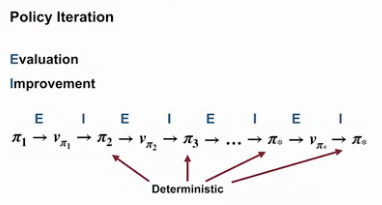

Coursera website:  [course 1 - Fundamentals of Reinforcement Learning](https://www.coursera.org/learn/fundamentals-of-reinforcement-learning/home/welcome) of [Reinforcement Learning Specialization](https://www.coursera.org/specializations/reinforcement-learning)

my notes on [course 2 - Sample-based Learning Methods](/guillaume_blog/blog/reinforcement-learning-specialization-coursera-course2.html), [course 3 - Prediction and Control with Function Approximation](/guillaume_blog/blog/reinforcement-learning-specialization-coursera-course3.html), [course 4 - A Complete Reinforcement Learning System (Capstone)](/guillaume_blog/blog/reinforcement-learning-specialization-coursera-course4.html)

[Syllabus](https://www.coursera.org/specializations/reinforcement-learning)

4 courses on 16 weeks by Martha White and Adam White.

* [Fundamentals of Reinforcement Learning](https://www.coursera.org/learn/fundamentals-of-reinforcement-learning?specialization=reinforcement-learning)

* [Sample-based Learning Methods](https://www.coursera.org/learn/sample-based-learning-methods?specialization=reinforcement-learning)

* [Prediction and Control with Function Approximation](https://www.coursera.org/learn/prediction-control-function-approximation?specialization=reinforcement-learning)

* [A Complete Reinforcement Learning System (Capstone)](https://www.coursera.org/learn/complete-reinforcement-learning-system?specialization=reinforcement-learning)

**specialization roadmap**

**course 1** - we begin our study with multi-arm bandit problems. Here, we get our first taste of the complexities of **incremental learning**, **exploration**, and **exploitation**. After that, we move onto **Markov decision processes** to broaden the class of problems we can solve with reinforcement learning methods. Here we will learn about **balancing short-term and long-term reward**. We will introduce key ideas like **policies** and **value functions** using almost all RL systems. We conclude Course 1 with classic planning methods called **dynamic programming**. These methods have been used in large industrial control problems and can compute optimal policies given a complete model of the world. 

**course 2** - In Course 2, we built on these ideas and design algorithms for learning **without a model** of the world. We study three classes of methods designed for learning from trial and error interaction. We start with **Monte Carlo** methods and then move on to **temporal difference** learning, including Q learning. We conclude Course 2 with an investigation of methods for **planning** with learned models. 

**course 3** - In Course 3, we leave the relative comfort of small finite MDPs and investigate RL with **function approximation**. Here we will see that the main concepts from Courses 1 and 2 transferred to problems with larger **infinite state spaces**. We will cover **feature construction**, **neural network learning**, **policy gradient methods**, and other particularities of the function approximation setting. 

**course 4** - The final course in this specialization brings everything together in a Capstone project. Throughout this specialization, as in Rich and Andy's book, we stress a rigorous and scientific approach to RL. We conduct numerous experiments designed to carefully compare algorithms. It takes careful planning and a lot of hard work to produce a meaningful empirical results. In the Capstone, we will walk you through each step of this process so that you can conduct your own scientific experiment. We will explore all the stages from problem specification, all the way to publication quality plots. This is not just academic. In real problems, it's important to verify and understand your system. After that, you should be ready to test your own new ideas or tackle a new exciting application of RL in your job. We hope you enjoyed the show half as much as we enjoyed making it for you. 

Alberta is in Canada.

## 5/3/21 - Course 1 - Week 1 - An introduction to Sequential Decision-Making

I have set recommended goals 3 times a week.

**about supervised learning, unsupervised learning and RL**

You might wonder what's the difference between supervised learning, unsupervised learning, and reinforcement learning? The differences are quite simple. In supervised learning we assume the learner has access to labeled examples giving the correct answer. In RL, the reward gives the agent some idea of how good or bad its recent actions were. You can think of supervised learning as requiring a teacher that helps you by telling you the correct answer. A reward on the other hand, is like having someone who can identify what good behavior looks like but can't tell you exactly how to do it. Unsupervised learning sounds like it could be related but really has a very different goal. Unsupervised learning is about extracting underlying structure in data. It's about the data representation. It can be used to construct representations that make a supervised or RL system better. In fact, as you'll see later in this course, techniques from both supervised learning and unsupervised learning can be used within RL to aid generalization

**industrial control**

So I think the place we're really going to see it take off is an industrial control. In industrial control, we have experts that are really looking for ways to improve the optimal- how well their systems work. So we're going to see it do things like reduce energy costs or save on other types of costs that we have in these industrial control systems. In the hands of experts, we can really make these algorithms work well in the near future. So I really see it as a tool that's going to facilitate experts in their work rather than say, doing something like replacing people or automating them away. 

**Reinforcement Learning Textbook**

as always, **Reinforcement Learning: An introduction (Second Edition) by Richard S. Sutton and Andrew G. Barto** is THE reference. I didn't know that Adam White was student from Sutton. Lucky guy ;)

**K-armed Bandit problem**

Starts with reading of RLbook p25-36 (Chapter 2 Multi-armed Bandits)

[Evaluative](http://incompleteideas.net/book/first/ebook/node14.html) vs instructive feedback. Nonassociative refers to cases where you take one action per state. At the end there is a generalization where bandit problem becomes associative, that is, when actions are taken in more than one situation.

It is a stationary case meaning that value of actions are fixed during experiences. If the bandit task were nonstationary, that is, the true values of the actions changed over time. In this case exploration is needed even in the deterministic case to make sure one of the nongreedy actions has not changed to become better than the greedy one.

sample-average action-value estimates

$$
Q_t(a) = \frac{\text{sum of rewards when } \mathit{a} \text{ taken prior to }\mathit{t}}{\text{number of times } \mathit{a} \text{ taken prior to }\mathit{t}} \\
Q_t(a)  = \frac{\displaystyle\sum_{i=1}^{t-1} R_i.\mathcal{1}_{A_i=a}}{\displaystyle\sum_{i=1}^{t-1} \mathcal{1}_{A_i=a}}
$$

$\epsilon$-greedy action selection

$$
A_t=\underset{a}{\mathrm{argmax}}{\text{ }Q_t(a)}
$$

With nonstationary problem, we want to give more weights to recent rewards. It can be done with
$$
Q_{n+1}=Q_n+\alpha[R_n-Q_n]
$$
Where $$\alpha$$ is a constant step-size parameter, $$\alpha \in [0,1]$$. So it can be written that way
$$
Q_{n+1}=(1-\alpha)^nQ_1+\displaystyle\sum_{i=1}^{n} \alpha(1-\alpha)^{n-i}R_i
$$
. Weighted average because the sum of the weights is 1.

2 other topics are discussed: **optimistic initial values** (that can push exploration in 1st steps) and **upper-confidence-bound (UCB)** action selection. With optimistic initial values the idea is too have high initial value for reward so that the 1st actions are disappointing pushing for explorations. With UCB 

$$
A_t= \underset{a} {\mathrm{argmax}} {\text{ }\bigg[Q_t(a)+c\sqrt{\frac{\ln t}{N_t(a)}}\bigg]}
$$

> The idea of this upper confidence bound (UCB) action selection is that the square-root term is a measure of the uncertainty or variance in the estimate of a’s value. The quantity being max’ed over is thus a sort of upper bound on the possible true value of action a, with c determining the confidence level. Each time a is selected the uncertainty is presumably reduced: N t (a) increments, and, as it appears in the denominator, the uncertainty term decreases. On the other hand, each time an action other than a is selected, t increases but N t (a) does not; because t appears in the numerator, the uncertainty estimate increases. The use of the natural logarithm means that the increases get smaller over time, but are unbounded; all actions will eventually be selected, but actions with lower value estimates, or that have already been selected frequently, will be selected with decreasing frequency over time.

**Exploration vs Exploitation trade-off**

How do we choose when to explore, and when to exploit? Randomly

**Assignement**

implementation of greedy agent, $\epsilon$-greedy agent. Comparisons. Various $\epsilon$ values, various step-sizes (1/N(a), ...)

notebooks in [github](https://github.com/castorfou/Reinforcement-Learning-specialization/tree/main/assignements/course%201%20week%201)

end of C1W1 (course 1 week 1)

## 5/7/21 - Course 1 - Week 2 - Markov Decision Process

###### Module 2 Learning Objectives

**Lesson 1: Introduction to Markov Decision Processes**   

- Understand Markov Decision Processes, or MDPs 

- Describe how the dynamics of an MDP are defined 

- Understand the graphical representation of a Markov Decision Process 

- Explain how many diverse processes can be written in terms of the MDP framework  

**Lesson 2: Goal of Reinforcement Learning**   

- Describe how rewards relate to the goal of an agent 

- Understand episodes and identify episodic tasks  

**Lesson 3: Continuing Tasks** 

- Formulate returns for continuing tasks using discounting 

- Describe how returns at successive time steps are related to each other 

- Understand when to formalize a task as episodic or continuing 

###### Lesson 1: Introduction to Markov Decision Processes

**Reading** chapter 3.1 to 3.3 (p47-56) in Sutton's book 

**Finite Markov Decision Processes** 

- 3.1 - the Agent-Environment Interface
- 3.2 - Goals and Rewards
- 3.3 - Returns and Episodes

In a Markov decision process, the probabilities given by p completely characterize the environment’s dynamics. That is, the probability of each possible value for $S_t$ and  $R_t$ depends only on the immediately preceding state and action, $S_{t-1}$ and $A_{t-1}$ , and, given them, not at all on earlier states and actions.

$$
p(s',r|s,a) \doteq Pr\{S_t=s', R_t=r|S_{t-1}=s, A_{t-1}=a\}
$$

The **state** must include information about all aspects of the past agent–environment interaction that make a difference for the future. In general, **actions** can be any decisions we want to learn how to make, and the states can be anything we can know that might be useful in making them.

The **agent–environment** boundary represents the limit of the agent’s absolute control, not of its knowledge.

**Goal** can be well thought of as the maximization of the expected value of the cumulative sum of a received scalar signal (called **reward**). The reward signal is your way of communicating to the agent what you want it to achieve, not how you want it achieved. 

**Expected return** $G_t$ is defined as some specific function of the reward sequence. In the simplest case the return is the sum of the rewards:
$$
G_t \doteq R_{t+1}+R_{t+2}+R_{t+3}+...+R_{T}
$$
where $T$ is the final time step.

With *continuing* tasks, we can have $T=\infty$, we can then introduce *discounting*. Agent chooses $A_t$ to maximize the expected discounted return:
$$
G_t \doteq R_{t+1}+\gamma R_{t+2}+\gamma^2 R_{t+3}+...=\displaystyle\sum_{k=0}^{\infty} \gamma^k R_{t+k+1}
$$
where $\gamma$ is called the *discount rate*.
$$
G_t = R_{t+1}+\gamma G_{t+1}
$$
**Video MDP** by Martha. By the end of this video: *Understand* **Markov Decision Process (MDP)**, *Describe* how the **dynamics of an MDP** are defined.

Martha highlights differences between k-armed bandit and MDP. The k-armed bandit agent is presented with the same situation at each time and the same action is always optimal. In many problems, different situations call for different responses. The actions we choose now affect the amount of reward we can get into the future.  In particular if state changes, k-armed bandit don't adapt. It is why we need MDP.

**Video examples of MDPs** by Adam . By the end of this video: Gain experience **formalizing decision-making problems as MDPs**, Appreciate the *flexibility* of the MDP formalism.

Adam uses 2 examples: robot recycling cans and robot arm. 

###### Lesson 2: Goal of Reinforcement Learning

**Video the Goal of Reinforcement Learning** by Adam. By the end of this video: *Describe* how rewards relate to the **goal** of an agent, *Identify* **episodic tasks**.

With MDP, agents can have long-term goals.

**Video the Reward Hypothesis** by Michael Littman.

He gives a nice idea when defining reward hypothesis: a contrast between the simplicity of the idea of rewards with the complexity of the real world.

###### Lesson 3: Continuing Tasks

**Video Continuing Tasks** by Martha. By the end of this video: *Differentiate* between **episodic** and **continuing tasks**. *Formulate* returns for continuing tasks using **discounting**. *Describe* how **returns at successive time steps** are related to each other.

Adam uses a [link](http://www.incompleteideas.net/book/the-book.html) to Sutton's book., This is a 2020 version of this book.

**Video Examples of Episodic and Continuing Tasks** by Martha. By the end of this video: *Understand* when to formalize a task as **episodic or continuing**.

Martha gives 2 examples: one of an episodic tasks where episode ends when player is touched by an enemy, one of continuous tasks where an agent accepts or rejects tasks depending on priority and servers available (never ending episode).

Weekly assessment.

This is a quizz and a peer-graded assignment. I had to describe 3 MDPs with all its detail (states actions, rewards).

## 5/10/21 - Course 1 - Week 3 - Value Functions & Bellman Equations

###### Module 3 Learning Objectives

**Lesson 1: Policies and Value Functions**

- Recognize that a policy is a distribution over actions for each possible state 
- Describe the similarities and differences between stochastic and deterministic policies 
- Identify the characteristics of a well-defined policy 
- Generate examples of valid policies for a given MDP 
- Describe the roles of state-value and action-value functions in reinforcement learning 
- Describe the relationship between value functions and policies 
- Create examples of valid value functions for a given MDP  

**Lesson 2: Bellman Equations**

- Derive the Bellman equation for state-value functions 
- Derive the Bellman equation for action-value functions 
- Understand how Bellman equations relate current and future values 
- Use the Bellman equations to compute value functions  

**Lesson 3: Optimality (Optimal Policies & Value Functions)**

- Define an optimal policy 
- Understand how a policy can be at least as good as every other policy in every state 
- Identify an optimal policy for given MDPs 
- Derive the Bellman optimality equation for state-value functions 
- Derive the Bellman optimality equation for action-value functions 
- Understand how the Bellman optimality equations relate to the previously introduced Bellman equations 
- Understand the connection between the optimal value function and optimal policies 
- Verify the optimal value function for given MDPs 

###### Lesson 1: Policies and Value Functions

**Reading** chapter 3.5 to 3.8 (p58-67) in Sutton's book 

Almost all reinforcement learning algorithms involve estimating **value functions**—functions of states (or of state–action pairs) that estimate how good it is for the agent to be in a given state (or how good it is to perform a given action in a given state).

Searching for additional informations, I have fallen into [ShangtongZhang](https://shangtongzhang.github.io/) page and [repos](https://github.com/ShangtongZhang). Only 2 of them but seem to be great: **[reinforcement-learning-an-introduction](https://github.com/ShangtongZhang/reinforcement-learning-an-introduction)** contains implementations in Python of all concepts from Sutton's book. **[DeepRL](https://github.com/ShangtongZhang/DeepRL)** seems to be a pytorch implementations (DQN, A2C, PPO, ...)

Here we see **Bellman equation** for state-value function $v_\pi(s)$

$$
v_\pi(s) \doteq \mathbb{E}[G_t|S_t=s]
\\
v_\pi(s) = \displaystyle\sum_{a} \pi(a|s) \displaystyle\sum_{s',r} p(s', r|s, a)\big[r+\gamma.v_\pi(s')\big]
$$

**Bellman equation** for action-value function $q_\pi(s,a)$

$$
q_\pi(s,a) \doteq \mathbb{E}[R_{t+1}+\gamma.G_{t+1}|S_t=s, A_t=a]
\\
q_\pi(s, a) = \displaystyle\sum_{s',r} p(s', r|s, a) \big[ r + \gamma\displaystyle\sum_{a'} \pi(s', a')q_\pi(s',a') \big]
$$

**Optimal state-value function $v_*$**: 

$$
v_*(s)\doteq \max\limits_{\pi} v_\pi(s), \forall s \in S
$$

**Optimal action-value function $q_*$**: 
$$
q_*(s,a) \doteq \max\limits_{\pi} q_\pi(s,a) = \mathbb{E}[R_{t+1}+\gamma.v_*(S_{t+1})|S_t=s, A_t=a]
$$

We denote all optimal policies by $\pi_*$

**Bellman optimality equation** for $v_*$

$$
v_*(s) = \max\limits_{a} \displaystyle\sum_{s', r} p(s',r|s, a)\big[ r + \gamma .v_*(s') \big]
$$

**Bellman optimality equation** for $q_*$

$$
q_*(s,a) = \displaystyle\sum_{s',r} p(s', r|s, a) \big[ r + \gamma.\max\limits_{a'} q_*(s',a') \big]
$$

**Video Specifying Policies** by Adam.

By the end of this video, you'll be able to

*Recognize* that a **policy** is a **distribution over actions** for each possible **state**, *describe* the similarities and differences between **stochastic and deterministic policies**, and *generate examples* of **valid policies** for a given MDP or Markup Decision Process. 

**Video Value Functions** by Adam.

By the end of this video, you'll be able to

*describe the roles* of the **state-value and** **action-value functions** in reinforcement learning, *describe the relationship* between **value-functions** and **policies**, and *create examples* of **value-functions** for a given MDP. 

**Video Rich Sutton and Andy Barto: A brief History of RL**

###### Lesson 2: Bellman Equations

**Video Bellman Equation Derivation** by Martha

By the end of this video, you'll be able to *derive* the **Bellman equation** for **state-value functions**, *derive* the **Bellman equation** for **action-value functions**, and *understand* how **Bellman equations** relate **current** and **future values**. 

**Video Why Bellman Equations?** by Martha

By the end of this video, you'll be able to *use* the **Bellman equations** to compute **value functions**

###### Lesson 3: Optimality (Optimal Policies & Value Functions)

**Video Optimal Policies** by Martha

By the end of this video, you will be able to *define* an **optimal policy**, *understand* how **policy** can be at least as good as every other policy in every state, and *identify* an **optimal policy** for a given MDP. 

**Video Optimal Value Functions** by Martha

By the end of this video, you will be able to *derive* the **Bellman optimality equation** for the **state-value function**, *derive* the **Bellman optimality equation** for the **action-value function**, and *understand* how the **Bellman optimality equations** relate to the previously introduced **Bellman equations**. 

**Video Using Optimal Value Functions to Get Optimal Policies** by Martha

By the end of this video, you'll be able to *understand* the connection between the **optimal value function** and **optimal policies** and *verify* the **optimal value function** for a given MDP

**Video week 3 summary** by Adam

## 5/18/21 - Course 1 - Week 4 - Dynamic Programming

###### Module 4 Learning Objectives

**Lesson 1: Policy Evaluation (Prediction)** 

- Understand the distinction between policy evaluation and control 
- Explain the setting in which dynamic programming can be applied, as well as its limitations 
- Outline the iterative policy evaluation algorithm for estimating state values under a given policy  
- Apply iterative policy evaluation to compute value functions   

**Lesson 2: Policy Iteration (Control)**  

- Understand the policy improvement theorem 
- Use a value function for a policy to produce a better policy for a given MDP 
- Outline the policy iteration algorithm for finding the optimal policy 
- Understand “the dance of policy and value” 
- Apply policy iteration to compute optimal policies and optimal value functions  

**Lesson 3: Generalized Policy Iteration** 

- Understand the framework of generalized policy iteration 
- Outline value iteration, an important example of generalized policy iteration 
- Understand the distinction between synchronous and asynchronous dynamic programming methods 
- Describe brute force search as an alternative method for searching for an optimal policy 
- Describe Monte Carlo as an alternative method for learning a value function 
- Understand the advantage of Dynamic programming and “bootstrapping” over these alternative strategies for finding the optimal policy 

###### Lesson 1: Policy Evaluation (Prediction) 

**Reading** chapter **4.1, 4.2, 4.3, 4.4, 4.6, 4.7** **(pages 73-88)**  in Sutton's book (with the help of [Solutions_to_Reinforcement_Learning_by_Sutton_Chapter_4_r5.pdf](https://github.com/LyWangPX/Reinforcement-Learning-2nd-Edition-by-Sutton-Exercise-Solutions/blob/master/Chapter%204/Solutions_to_Reinforcement_Learning_by_Sutton_Chapter_4_r5.pdf))

A common way of obtaining approximate solutions for tasks with **continuous states** **and actions** is to **quantize** the state and action spaces and then apply finite-state DP methods.

**Video Policy Evaluation vs. Control** by Martha

By the end of this video you will be able to *understand* the distinction between **policy evaluation** and **control**, and *explain* the setting in which **dynamic programming** can be applied as well as its limitations. 

**Video Iterative Policy Evaluation** by Martha

By the end of this video you will be able to *outline* the **iterative policy evaluation** algorithm for estimating state values for a given policy, and *apply* iterative policy evaluation to compute value functions. 

The magic here is to turn the bellman equation into an iterative evaluation which converges to $v_\pi$.

###### Lesson 2: Policy Iteration (Control) 

**Video Policy Improvement** by Marta

By the end of this video, you will be able to *understand* the **policy improvement theorem**, and how it can be used to construct improved policies, and *use* the value function for a policy to produce a better policy for a given MDP. 

Greedified policy is a strict improvement.

**Video Policy Iteration** by Marta

By the end of this video, you will be able to *outline* the **policy iteration** algorithm for finding the optimal policy, *understand* the **dance of policy and value**, how policy iteration reaches the optimal policy by alternating between evaluating policy and improving it, and *apply* policy iteration to compute optimal policies and optimal value functions. 

###### Lesson 3: Generalized Policy Iteration

**Video Flexibility of the Policy Iteration Framework** by Adam

By the end of this video, you'll be able to *understand* the framework of **generalized policy iteration**, *outline* **value iteration** and important special case of generalized policy iteration, and *differentiate* **synchronous** and **asynchronous** dynamic programming methods. 

**Video Efficiency of Dynamic Programming** by Adam

By the end of this video, you'll be able to *describe* **Monte Carlo sampling** as an alternative method for learning a value function. *Describe* **brute force-search** as an alternative method for finding an optimal policy. And *understand* the advantages of **dynamic programming** and **bootstrapping** over these alternatives. 

The most important takeaway is that bootstrapping can save us from performing a huge amount of unnecessary work by exploiting the connection between the value of a state and its possible successors. 

**Video Warren Powell: Approximate Dynamic Programming for Fleet Management (Short)**

**Video Week 4 Summary** by Adam

Reading chapter summary **Chapter 4.8, (pages 88-89)**

###### Assignment

Optimal Policies with Dynamic Programming

notebooks in [github](https://github.com/castorfou/Reinforcement-Learning-specialization/tree/main/assignements/course%201%20week%204)

end of C1W4 (course 1 week 4)

end of course 1 (and with a [certificate](https://github.com/castorfou/Reinforcement-Learning-specialization/blob/main/certificates/course%201.pdf) ;) )

