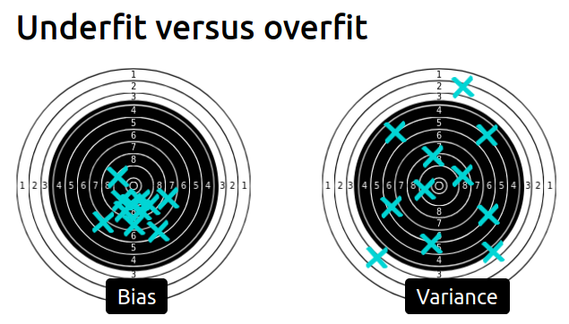
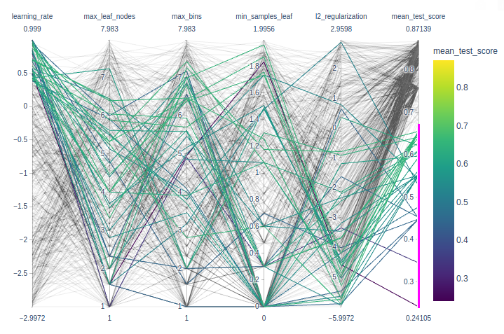

This is a [MOOC](https://lms.fun-mooc.fr/courses/course-v1:inria+41026+session01/info) by Inria team, in charge of scikit-learn.


> After a fair amount of pedagogical and technical preparation work, we offer you today a practical course with:
>
> - 7 modules + 1 introductory module
> - 9 video lessons to explain the main machine learning concepts
> - 71 programming notebooks (you don't have to install anything) to get hands-on skills
> - 27 quizzes, 7 wrap-up quizzes and 23 exercises to train and deepen your practice


[Syllabus](https://lms.fun-mooc.fr/courses/course-v1:inria+41026+session01/496272d6f8444957a7014122a4646116/)

Introduction:  Machine Learning concepts, then

Module 1. The Predictive Modeling Pipeline 

Module 2. Selecting the best model 

Module 3. Hyperparameter tuning 

Module 4. Linear Models 

Module 5. Decision tree models 

Module 6. Ensemble of models

Module 7. Evaluating model performance


[INRIA github](https://github.com/INRIA/scikit-learn-mooc) contains everything of this mooc: slides, datasets, notebooks (not videos)

I have forked it, and I use local envt for assignments. 

```bash
~/git/guillaume$ git clone git@github.com:castorfou/scikit-learn-mooc.git
~/git/guillaume$ cd scikit-learn-mooc/
~/git/guillaume/scikit-learn-mooc$ conda env create -f environment.yml
conda activate scikit-learn-course
```


## Introduction - Machine Learning concepts

[slides](https://inria.github.io/scikit-learn-mooc/slides/?file=ml_concepts.md#1)

<iframe title="Slides" marginheight="0" src="https://inria.github.io/scikit-learn-mooc/slides/?file=ml_concepts.md#1" width="800" height="500" frameborder="0">
</iframe>


## Module 1. The Predictive Modeling Pipeline 

###### Module overview

> The objective in the module are the following:
>
> - build intuitions regarding an unknown dataset;
> - identify and differentiate numerical and categorical features;
> - create an advanced predictive pipeline with scikit-learn.

###### Tabular data exploration

exploration of data: [01_tabular_data_exploration.ipynb](https://github.com/castorfou/scikit-learn-mooc/blob/master/notebooks/01_tabular_data_exploration.ipynb)

exercise M1.01: [01_tabular_data_exploration_ex_01.ipynb](https://github.com/castorfou/scikit-learn-mooc/blob/master/notebooks/01_tabular_data_exploration_ex_01.ipynb)


###### Fitting a scikit-learn model on numerical data

first model with scikit-learn: [02_numerical_pipeline_introduction.ipynb](https://github.com/castorfou/scikit-learn-mooc/blob/master/notebooks/02_numerical_pipeline_introduction.ipynb)

exercise M1.02: [02_numerical_pipeline_ex_00.ipynb](https://github.com/castorfou/scikit-learn-mooc/blob/master/notebooks/02_numerical_pipeline_ex_00.ipynb)

working with numerical data: [02_numerical_pipeline_hands_on.ipynb](https://github.com/castorfou/scikit-learn-mooc/blob/master/notebooks/02_numerical_pipeline_hands_on.ipynb)

exercise M1.03: [02_numerical_pipeline_ex_01.ipynb](https://github.com/castorfou/scikit-learn-mooc/blob/master/notebooks/02_numerical_pipeline_ex_01.ipynb)

preprocessing for numerical features: [02_numerical_pipeline_scaling.ipynb](https://github.com/castorfou/scikit-learn-mooc/blob/master/notebooks/02_numerical_pipeline_scaling.ipynb)


###### Handling categorical data

Encoding of categorical variables: [03_categorical_pipeline.ipynb](https://github.com/castorfou/scikit-learn-mooc/blob/master/notebooks/03_categorical_pipeline.ipynb)

> Thus, in general `OneHotEncoder` is the encoding strategy used when the downstream models are **linear models** while `OrdinalEncoder` is used with **tree-based models**.

Exercise M1.04: [03_categorical_pipeline_ex_01.ipynb](https://github.com/castorfou/scikit-learn-mooc/blob/master/notebooks/03_categorical_pipeline_ex_01.ipynb)

Using numerical and categorical variables together: [03_categorical_pipeline_column_transformer.ipynb](https://github.com/castorfou/scikit-learn-mooc/blob/master/notebooks/03_categorical_pipeline_column_transformer.ipynb)

Exercise M1.05: [03_categorical_pipeline_ex_02.ipynb](https://github.com/castorfou/scikit-learn-mooc/blob/master/notebooks/03_categorical_pipeline_ex_02.ipynb)


###### Wrap-up quiz

[module 1 - wrap-up quizz.ipynb](https://github.com/castorfou/scikit-learn-mooc/blob/master/jupyter-book/predictive_modeling_pipeline/module%201%20-%20wrap-up%20quizz.ipynb)


## Module 2. Selecting the best model

###### Module overview

> The objective in the module are the following:
>
> - understand the concept of overfitting and underfitting;
> - understand the concept of generalization;
> - understand the general cross-validation framework used to evaluate a model.

###### Overfitting and Underfitting

video and [slides](https://inria.github.io/scikit-learn-mooc/slides/?file=overfitting_vs_underfitting.md#1)

<iframe title="Slides" marginheight="0" src="https://inria.github.io/scikit-learn-mooc/slides/?file=overfitting_vs_underfitting.md#1" width="800" height="500" frameborder="0">
</iframe>

The framework and why do we need it: [cross_validation_train_test.ipynb](https://github.com/castorfou/scikit-learn-mooc/blob/master/notebooks/cross_validation_train_test.ipynb)


###### Validation and learning curves

video and [slides](https://inria.github.io/scikit-learn-mooc/slides/?file=learning_validation_curves.md#1)

<iframe title="Slides" marginheight="0" src="https://inria.github.io/scikit-learn-mooc/slides/?file=learning_validation_curves.md#1" width="800" height="500" frameborder="0">
</iframe>

Overfit-generalization-underfit: [cross_validation_validation_curve.ipynb](https://github.com/castorfou/scikit-learn-mooc/blob/master/notebooks/cross_validation_validation_curve.ipynb)

Effect of the sample size in cross-validation: [cross_validation_learning_curve.ipynb](https://github.com/castorfou/scikit-learn-mooc/blob/master/notebooks/cross_validation_learning_curve.ipynb)

Exercise M2.01: [cross_validation_ex_01.ipynb](https://github.com/castorfou/scikit-learn-mooc/blob/master/notebooks/cross_validation_ex_01.ipynb) [solution](https://github.com/castorfou/scikit-learn-mooc/blob/master/notebooks/cross_validation_sol_01.ipynb)


###### Bias versus variance trade-off

video and [slides](https://inria.github.io/scikit-learn-mooc/slides/?file=bias_vs_variance.md#1)

<iframe title="Slides" marginheight="0" src="https://inria.github.io/scikit-learn-mooc/slides/?file=bias_vs_variance.md#1" width="800" height="500" frameborder="0">
</iframe>



###### Wrap-up quiz

[module 2 - wrap-up quizz.ipynb](https://github.com/castorfou/scikit-learn-mooc/blob/master/jupyter-book/overfit/overfit_wrap_up_quiz.ipynb)

> - **Overfitting** is caused by the **limited size of the training set**, the **noise** in the data, and the **high flexibility** of common machine learning models.
> - **Underfitting** happens when the learnt prediction functions suffer from **systematic errors**. This can be caused by a choice of model family and parameters, which leads to a **lack of flexibility** to capture the repeatable structure of the true data generating process.
> - For a fixed training set, the objective is to **minimize the test error** by adjusting the model family and its parameters to find the **best trade-off between overfitting for underfitting**.
> - For a given choice of model family and parameters, **increasing the training set size will decrease overfitting** but can also cause an increase of underfitting.
> - The test error of a model that is neither overfitting nor underfitting can still be high if the variations of the target variable cannot be fully determined by the input features. This irreducible error is caused by what we sometimes call label noise. In practice, this often happens when we do not have access to important features for one reason or another.


## Module 3. Hyperparameter tuning

###### Module overview

> The objective in the module are the following:
>
> - understand what is a model hyperparameter;
> - understand how to get and set the value an hyperparameter of a scikit-learn model;
> - be able to fine tune a full predictive modeling pipeline;
> - understand and visualize the combination of parameters that improves the performance of a model.

###### Manual tuning

Set and get hyperparameters in scikit-learn: [parameter_tuning_manual.ipynb](https://github.com/castorfou/scikit-learn-mooc/blob/master/notebooks/parameter_tuning_manual.ipynb)

Exercise M3.01: [parameter_tuning_ex_02.ipynb](https://github.com/castorfou/scikit-learn-mooc/blob/master/notebooks/parameter_tuning_ex_02.ipynb)

###### Automated tuning

Hyperparameter tuning by grid-search: [parameter_tuning_grid_search.ipynb](https://github.com/castorfou/scikit-learn-mooc/blob/master/notebooks/parameter_tuning_grid_search.ipynb)

Hyperparameter tuning by randomized-search: [parameter_tuning_randomized_search.ipynb](https://github.com/castorfou/scikit-learn-mooc/blob/master/notebooks/parameter_tuning_randomized_search.ipynb)

Cross-validation and hyperparameter tuning: [parameter_tuning_nested.ipynb](https://github.com/castorfou/scikit-learn-mooc/blob/master/notebooks/parameter_tuning_nested.ipynb)

Exercise M3.01: [parameter_tuning_ex_03.ipynb](https://github.com/castorfou/scikit-learn-mooc/blob/master/notebooks/parameter_tuning_ex_03.ipynb) [solution](https://github.com/castorfou/scikit-learn-mooc/blob/master/notebooks/parameter_tuning_sol_03.ipynb)



Nice to play with interactive plotly parallel_coordinates to identify best params.

```python
import numpy as np
import pandas as pd
import plotly.express as px
def shorten_param(param_name):
    if "__" in param_name:
        return param_name.rsplit("__", 1)[1]
    return param_name
cv_results = pd.read_csv("../figures/randomized_search_results.csv",
                         index_col=0)

fig = px.parallel_coordinates(
    cv_results.rename(shorten_param, axis=1).apply({
        "learning_rate": np.log10,
        "max_leaf_nodes": np.log2,
        "max_bins": np.log2,
        "min_samples_leaf": np.log10,
        "l2_regularization": np.log10,
        "mean_test_score": lambda x: x}),
    color="mean_test_score",
    color_continuous_scale=px.colors.sequential.Viridis,
)
fig.show()
```

###### Wrap-up quiz

[module 3 - wrap-up quizz.ipynb](https://github.com/castorfou/scikit-learn-mooc/blob/master/jupyter-book/tuning/tuning_questions.ipynb)

> - Hyperparameters have an impact on the models’ performance and should be wisely chosen;
> - The search for the best hyperparameters can be automated with a grid-search approach or a randomized search approach;
> - A grid-search is expensive and does not scale when the number of hyperparameters to optimize increase. Besides, the combination are sampled only on a regular grid.
> - A randomized-search allows a search with a fixed budget even with an increasing number of hyperparameters. Besides, the combination are sampled on a non-regular grid.


## Module 4. Linear models

###### Module overview

> In this module, your objectives are to:
>
> - understand the linear models parametrization;
> - understand the implication of linear models in both regression and classification;
> - get intuitions of linear models applied in higher dimensional dataset;
> - understand the effect of regularization and how to set it;
> - understand how linear models can be used even with data showing non-linear relationship with the target to be predicted.

###### Intuitions on linear models

video and [slides](https://inria.github.io/scikit-learn-mooc/slides/?file=linear_models.md#1)

<iframe title="Slides" marginheight="0" src="https://inria.github.io/scikit-learn-mooc/slides/?file=linear_models.md#1" width="800" height="500" frameborder="0">
</iframe>

For regression: linear regression

```python
from sklearn.linear_model import LinearRegression
linear_regression = LinearRegression()
linear_regression.fit(X, y)
```

For classification: logistic regression

```python
from sklearn.linear_model import LogisticRegression
log_reg = LogisticRegression()
log_reg.fit(X, y)
```

###### Linear regression

Linear regression without scikit-learn: [linear_regression_without_sklearn.ipynb](https://github.com/castorfou/scikit-learn-mooc/blob/master/notebooks/linear_regression_without_sklearn.ipynb)

Exercise M4.01: [linear_models_ex_01.ipynb](https://github.com/castorfou/scikit-learn-mooc/blob/master/notebooks/linear_models_ex_01.ipynb) [solution](https://github.com/castorfou/scikit-learn-mooc/blob/master/notebooks/linear_models_sol_01.ipynb)

usage of `np.ravel` in

```python
def goodness_fit_measure(true_values, predictions):
    # we compute the error between the true values and the predictions of our model
    errors = np.ravel(true_values) - np.ravel(predictions)
    return np.mean(np.abs(errors))
```

Linear regression using scjkit-learn: [linear_regression_in_sklearn.ipynb](https://github.com/castorfou/scikit-learn-mooc/blob/master/notebooks/linear_regression_in_sklearn.ipynb)

```python
from sklearn.metrics import mean_squared_error
inferred_body_mass = linear_regression.predict(data)
model_error = mean_squared_error(target, inferred_body_mass)
print(f"The mean squared error of the optimal model is {model_error:.2f}")
```


###### Modeling non-linear features-target relationships

Exercise M4.02: [linear_models_ex_02.ipynb](https://github.com/castorfou/scikit-learn-mooc/blob/master/notebooks/linear_models_ex_02.ipynb) [solution](https://github.com/castorfou/scikit-learn-mooc/blob/master/notebooks/linear_models_sol_02.ipynb)

Linear regression with non-linear link between data and target: [linear_regression_non_linear_link.ipynb](https://github.com/castorfou/scikit-learn-mooc/blob/master/notebooks/linear_regression_non_linear_link.ipynb)

Exercise M4.03: [linear_models_ex_03.ipynb](https://github.com/castorfou/scikit-learn-mooc/blob/master/notebooks/linear_models_ex_03.ipynb) [solution](https://github.com/castorfou/scikit-learn-mooc/blob/master/notebooks/linear_models_sol_03.ipynb)


###### Regularization in linear model

video and [slides](https://inria.github.io/scikit-learn-mooc/slides/?file=regularized_linear_models.md#1)

<iframe title="Slides" marginheight="0" src="https://inria.github.io/scikit-learn-mooc/slides/?file=regularized_linear_models.md#1" width="800" height="500" frameborder="0">
</iframe>

Ridge regression

```python
from sklearn.linear_model import Ridge
model = Ridge(alpha=0.01).fit(X, y)
```

always use `Ridge` with a carefully tuned `alpha`!

```python
from sklearn.linear_model import RidgeCV
model = RidgeCV( alphas=[0.001, 0.1, 1, 10, 1000] )
model.fit(X, y)
print(model.alpha_)
```

Regularization of linear regression model: [linear_models_regularization.ipynb](https://github.com/castorfou/scikit-learn-mooc/blob/master/notebooks/linear_models_regularization.ipynb)

Exercise M4.04: [linear_models_ex_04.ipynb](https://github.com/castorfou/scikit-learn-mooc/blob/master/notebooks/linear_models_ex_04.ipynb) [solution](https://github.com/castorfou/scikit-learn-mooc/blob/master/notebooks/linear_models_sol_04.ipynb)


###### Linear model for classification

Linear model for classification: [logistic_regression.ipynb](https://github.com/castorfou/scikit-learn-mooc/blob/master/notebooks/logistic_regression.ipynb)

Exercise M4.05: [linear_models_ex_05.ipynb](https://github.com/castorfou/scikit-learn-mooc/blob/master/notebooks/linear_models_ex_04.ipynb) [solution](https://github.com/castorfou/scikit-learn-mooc/blob/master/notebooks/linear_models_sol_05.ipynb)

Beyond linear separation in classification: [logistic_regression_non_linear.ipynb](https://github.com/castorfou/scikit-learn-mooc/blob/master/notebooks/logistic_regression_non_linear.ipynb)


###### Wrap-up quiz

[module 4 - wrap-up quizz.ipynb](https://github.com/castorfou/scikit-learn-mooc/blob/master/jupyter-book/linear_models/module 4 - wrap-up-quizz.ipynb)

> In this module, we saw that:
>
> - the predictions of a linear model depend on a weighted sum of the values of the input features added to an intercept parameter;
> - fitting a linear model consists in adjusting both the weight coefficients and the intercept to minimize the prediction errors on the training set;
> - to train linear models successfully it is often required to scale the input features approximately to the same dynamic range;
> - regularization can be used to reduce over-fitting: weight coefficients are constrained to stay small when fitting;
> - the regularization hyperparameter needs to be fine-tuned by cross-validation for each new machine learning problem and dataset;
> - linear models can be used on problems where the target variable is not linearly related to the input features but this requires extra feature engineering work to transform the data in order to avoid under-fitting.


## Module 5. Decision tree models

###### Module overview

> The objective in the module are the following:
>
> - understand how decision trees are working in classification and regression;
> - check which tree parameters are important and their influences.

###### Intuitions on tree-based models

video and [slides](https://inria.github.io/scikit-learn-mooc/slides/?file=trees.md#1)

<iframe title="Slides" marginheight="0" src="https://inria.github.io/scikit-learn-mooc/slides/?file=trees.md#1" width="800" height="500" frameborder="0">
</iframe>

###### Decision tree in classification

Build a classification decision tree: [trees_classification.ipynb](https://github.com/castorfou/scikit-learn-mooc/blob/master/notebooks/trees_classification.ipynb)

Exercise M5.01: [trees_ex_01.ipynb](https://github.com/castorfou/scikit-learn-mooc/blob/master/notebooks/trees_ex_01.ipynb) [solution](https://github.com/castorfou/scikit-learn-mooc/blob/master/notebooks/trees_sol_01.ipynb)


Fit and decision boundaries

```python
from sklearn.tree import DecisionTreeClassifier
import seaborn as sns

# create a palette to be used in the scatterplot
palette = ["tab:red", "tab:blue", "black"]

tree = DecisionTreeClassifier(max_depth=2)
tree.fit(data_train, target_train)

ax = sns.scatterplot(data=penguins, x=culmen_columns[0], y=culmen_columns[1],
                     hue=target_column, palette=palette)
plot_decision_function(tree, range_features, ax=ax)
plt.legend(bbox_to_anchor=(1.05, 1), loc='upper left')
_ = plt.title("Decision boundary using a decision tree")
```

Decision tree

```python
from sklearn.tree import plot_tree

_, ax = plt.subplots(figsize=(17, 12))
_ = plot_tree(tree, feature_names=culmen_columns,
              class_names=tree.classes_, impurity=False, ax=ax)
```

Accuracy

```python
tree.fit(data_train, target_train)
test_score = tree.score(data_test, target_test)
print(f"Accuracy of the DecisionTreeClassifier: {test_score:.2f}")
```


###### Decision tree in regression

Decision tree for regression: [trees_regression.ipynb](https://github.com/castorfou/scikit-learn-mooc/blob/master/notebooks/trees_regression.ipynb)

Exercise M5.02: [trees_ex_02.ipynb](https://github.com/castorfou/scikit-learn-mooc/blob/master/notebooks/trees_ex_02.ipynb) [solution](https://github.com/castorfou/scikit-learn-mooc/blob/master/notebooks/trees_sol_02.ipynb)


###### Hyperparameters of decision tree

Importance of decision tree hyperparameters on generalization: [trees_hyperparameters.ipynb](https://github.com/castorfou/scikit-learn-mooc/blob/master/notebooks/trees_hyperparameters.ipynb)


###### Wrap-up quiz

[module 5 - wrap-up quizz.ipynb](https://github.com/castorfou/scikit-learn-mooc/blob/master/jupyter-book/trees/module 5 - wrap-up-quizz.ipynb)

[Main take-away | Main take-away | 41026 Courseware | FUN-MOOC](https://lms.fun-mooc.fr/courses/course-v1:inria+41026+session01/courseware/6565c007789a4812aea0debb1fb22e0f/0ab58cb806034cdba7bd49e8dd784202/)


> In this module, we presented decision trees in details. We saw that they:
>
> - are suited for both regression and classification problems;
> - are non-parametric models;
> - are not able to extrapolate;
> - are sensible to hyperparameter tuning.


## Module 6. Ensemble of models

###### Module overview

> The objective in the module are the following:
>
> - understanding the principles behind bootstrapping and boosting;
> - get intuitions with specific models such as random forest and gradient boosting;
> - identify the important hyperparameters of random forest and gradient boosting decision trees as well as their typical values.

###### Intuitions on ensemble of tree-based models

video and [slides](https://inria.github.io/scikit-learn-mooc/slides/?file=ensemble.md#1)


<iframe title="Slides" marginheight="0" src="https://inria.github.io/scikit-learn-mooc/slides/?file=ensemble.md#p" width="800" height="500" frameborder="0">
</iframe>
"Bagging" stands for Bootstrap AGGregatING. It uses bootstrap resampling (random sampling with replacement) to learn several models on random variations of the training set. At predict time, the predictions of each learner are aggregated to give the final predictions.

```python
from sklearn.ensemble import BaggingClassifier
from sklearn.ensemble import RandomForestClassifier
```

**Random Forests** are bagged *randomized* decision trees

- At each split: a random subset of features are selected
- The best split is taken among the restricted subset
- Extra randomization decorrelates the prediction errors
- Uncorrelated errors make bagging work better

**Gradient Boosting** 


- Each base model predicts the **negative error** of previous models
- `sklearn` use decision trees as the base model

```python
from sklearn.ensemble import GradientBoostingClassifier
```

- Implementation of the traditional (exact) method
- Fine for small data sets
- Too slow for `n_samples` > 10,000

```python
from sklearn.ensemble import HistGradientBoostingClassifier
```

- Discretize numerical features (256 levels)
- Efficient multi core implementation
- **Much, much faster** when `n_samples` is large


**Take away**

- **Bagging** and **random forests** fit trees **independently**
  - each **deep tree overfits** individually
  - averaging the tree predictions **reduces overfitting**
- (Gradient) **boosting** fits trees **sequentially**
  - each **shallow tree underfits** individually
  - sequentially adding trees **reduces underfitting**
- **Gradient boosting** tends to perform slightly better than **bagging** and **random forest** and furthermore shallow trees predict faster.


Introductory example to ensemble models: [ensemble_introduction.ipynb](https://github.com/castorfou/scikit-learn-mooc/blob/master/notebooks/ensemble_introduction.ipynb)


###### Ensemble method using bootstrapping

Bagging: [ensemble_bagging.ipynb](https://github.com/castorfou/scikit-learn-mooc/blob/master/notebooks/ensemble_bagging.ipynb)

Wikipedia reference to [bootstrapping](https://en.wikipedia.org/wiki/Bootstrapping_(statistics)) in statistics.

Exercise M6.01: [ensemble_ex_01.ipynb](https://github.com/castorfou/scikit-learn-mooc/blob/master/notebooks/ensemble_ex_01.ipynb) ([solution](https://github.com/castorfou/scikit-learn-mooc/blob/master/notebooks/ensemble_sol_01.ipynb))

Random Forest: [ensemble_random_forest.ipynb](https://github.com/castorfou/scikit-learn-mooc/blob/master/notebooks/ensemble_random_forest.ipynb)

Exercise M6.01: [ensemble_ex_02.ipynb](https://github.com/castorfou/scikit-learn-mooc/blob/master/notebooks/ensemble_ex_02.ipynb) ([solution](https://github.com/castorfou/scikit-learn-mooc/blob/master/notebooks/ensemble_sol_02.ipynb))


###### Ensemble method using boosting

Adaptive Boosting (AdaBoost): [ensemble_adaboost.ipynb](https://github.com/castorfou/scikit-learn-mooc/blob/master/notebooks/ensemble_adaboost.ipynb)

Exercise M6.03: [ensemble_ex_03.ipynb](https://github.com/castorfou/scikit-learn-mooc/blob/master/notebooks/ensemble_ex_03.ipynb) ([solution](https://github.com/castorfou/scikit-learn-mooc/blob/master/notebooks/ensemble_sol_03.ipynb))

Gradient-boosting decision tree (GBDT): [ensemble_gradient_boosting.ipynb](https://github.com/castorfou/scikit-learn-mooc/blob/master/notebooks/ensemble_gradient_boosting.ipynb)

Exercise M6.04: [ensemble_ex_04.ipynb](https://github.com/castorfou/scikit-learn-mooc/blob/master/notebooks/ensemble_ex_04.ipynb) ([solution](https://github.com/castorfou/scikit-learn-mooc/blob/master/notebooks/ensemble_sol_04.ipynb))

Speeding-up gradient-boosting:  [ensemble_hist_gradient_boosting.ipynb](https://github.com/castorfou/scikit-learn-mooc/blob/master/notebooks/ensemble_hist_gradient_boosting.ipynb)


###### Hyperparameter tuning with ensemble methods

Hyperparameter tuning: [ensemble_hyperparameters.ipynb](https://github.com/castorfou/scikit-learn-mooc/blob/master/notebooks/ensemble_hyperparameters.ipynb)

Exercise M6.05: [ensemble_ex_05.ipynb](https://github.com/castorfou/scikit-learn-mooc/blob/master/notebooks/ensemble_ex_05.ipynb) ([solution](https://github.com/castorfou/scikit-learn-mooc/blob/master/notebooks/ensemble_sol_05.ipynb))


###### Wrap-up quiz

[module 6 - wrap-up quizz.ipynb](https://github.com/castorfou/scikit-learn-mooc/blob/master/jupyter-book/ensemble/module 6 - wrap-up-quizz.ipynb)


Use of [Imbalanced-learn](https://imbalanced-learn.org/stable/) library relying on scikit-learn and provides methods to deal with classification with imbalanced classes.


## Module 7. Evaluating model performance

###### Module overview

> The objective in the module are the following:
>
> - understand the necessity of using an appropriate cross-validation strategy depending on the data;
> - get the intuitions behind comparing a model with some basic models that can be used as baseline;
> - understand the principles behind using nested cross-validation when the model needs to be evaluated as well as optimized;
> - understand the differences between regression and classification metrics;
> - understand the differences between metrics.

###### Comparing a model with simple baselines

Comparing results with baseline and chance level: [cross_validation_baseline.ipynb](https://github.com/castorfou/scikit-learn-mooc/blob/master/notebooks/cross_validation_baseline.ipynb)

Exercise M7.01: [cross_validation_ex_02.ipynb](https://github.com/castorfou/scikit-learn-mooc/blob/master/notebooks/cross_validation_ex_02.ipynb) ([solution](https://github.com/castorfou/scikit-learn-mooc/blob/master/notebooks/cross_validation_sol_02.ipynb))

###### Choice of cross-validation

Introductory exercise regarding stratification: [cross_validation_ex_03.ipynb](https://github.com/castorfou/scikit-learn-mooc/blob/master/notebooks/cross_validation_ex_03.ipynb) 

Stratification: [cross_validation_stratification.ipynb](https://github.com/castorfou/scikit-learn-mooc/blob/master/notebooks/cross_validation_stratification.ipynb)

Introductory exercise for sample grouping: [cross_validation_ex_04.ipynb](https://github.com/castorfou/scikit-learn-mooc/blob/master/notebooks/cross_validation_ex_04.ipynb) 

Sample grouping: [cross_validation_grouping.ipynb](https://github.com/castorfou/scikit-learn-mooc/blob/master/notebooks/cross_validation_grouping.ipynb)

Introductory exercise for non i.i.d. data:  [cross_validation_ex_05.ipynb](https://github.com/castorfou/scikit-learn-mooc/blob/master/notebooks/cross_validation_ex_05.ipynb) 

Non i.i.d. data:  [cross_validation_time.ipynb](https://github.com/castorfou/scikit-learn-mooc/blob/master/notebooks/cross_validation_time.ipynb) 


###### Nested cross-validation

Nested cross-validation:  [cross_validation_nested.ipynb](https://github.com/castorfou/scikit-learn-mooc/blob/master/notebooks/cross_validation_nested.ipynb) 


###### Introduction of the evaluation metrics: Classification metrics

Classification:  [metrics_classification.ipynb](https://github.com/castorfou/scikit-learn-mooc/blob/master/notebooks/metrics_classification.ipynb) 

Exercise M7.02: [metrics_ex_01.ipynb](https://github.com/castorfou/scikit-learn-mooc/blob/master/notebooks/metrics_ex_01.ipynb) ([solution](https://github.com/castorfou/scikit-learn-mooc/blob/master/notebooks/metrics_sol_01.ipynb))

###### Introduction of the evaluation metrics: Regression metrics

Regression:  [metrics_regression.ipynb](https://github.com/castorfou/scikit-learn-mooc/blob/master/notebooks/metrics_regression.ipynb) 

Exercise M7.03: [metrics_ex_02.ipynb](https://github.com/castorfou/scikit-learn-mooc/blob/master/notebooks/metrics_ex_02.ipynb) ([solution](https://github.com/castorfou/scikit-learn-mooc/blob/master/notebooks/metrics_sol_02.ipynb))

###### Wrap-up quiz

[module 7 - wrap-up quizz.ipynb](https://github.com/castorfou/scikit-learn-mooc/blob/master/jupyter-book/evaluation/module 7 - wrap-up-quizz.ipynb)


And this completes the course
