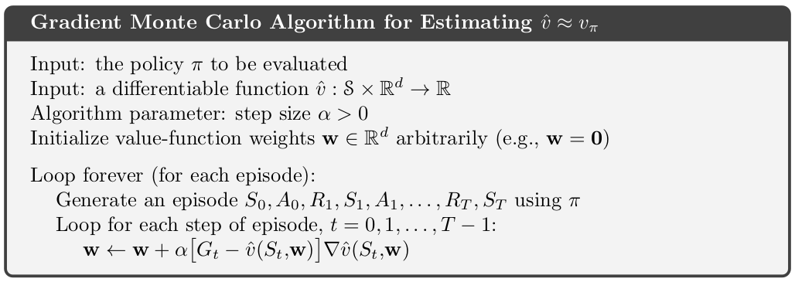

Coursera website:  [course 3 - Prediction and Control with Function Approximation](https://www.coursera.org/learn/prediction-control-function-approximation/home/welcome) of [Reinforcement Learning Specialization](https://www.coursera.org/specializations/reinforcement-learning)

my notes on [course 1 - Fundamentals of Reinforcement Learning](/guillaume_blog/blog/reinforcement-learning-specialization-coursera.html), [course 2 - Sample-based Learning Methods](/guillaume_blog/blog/reinforcement-learning-specialization-coursera-course2.html), [course 4 - A Complete Reinforcement Learning System (Capstone)](/guillaume_blog/blog/reinforcement-learning-specialization-coursera-course4.html)

**specialization roadmap** - course 3 - **Prediction and Control with Function Approximation** [(syllabus)](https://github.com/castorfou/Reinforcement-Learning-specialization/blob/main/course%203%20-%20function%20approximation/Course-3_Prediction-and-Control-with-Function-Approximation-Learning-Objectives.pdf)

**course 3** - In Course 3, we leave the relative comfort of small finite MDPs and investigate RL with **function approximation**. Here we will see that the main concepts from Courses 1 and 2 transferred to problems with larger **infinite state spaces**. We will cover **feature construction**, **neural network learning**, **policy gradient methods**, and other particularities of the function approximation setting.

Week 1 - On-policy Prediction with Approximation

Week 2 - Constructing Features for Prediction

Week 3 - Control with Approximation

Week 4 - Policy Gradient

###### Course introduction

**Video by Adam and Martha**

In course 2:

In course 3:

## Course 3 - Week 1 - On-policy Prediction with Approximation

###### Module 1 Learning Objectives

**Lesson 1: Estimating Value Functions as Supervised Learning** 

- Understand how we can use parameterized functions to approximate value functions 
- Explain the meaning of linear value function approximation 
- Recognize that the tabular case is a special case of linear value function approximation. 
- Understand that there are many ways to parameterize an approximate value function 
- Understand what is meant by generalization and discrimination 
- Understand how generalization can be beneficial 
- Explain why we want both generalization and discrimination from our function approximation 
- Understand how value estimation can be framed as a supervised learning problem 
- Recognize not all function approximation methods are well suited for reinforcement learning 

**Lesson 2: The Objective for On-policy Prediction** 

- Understand the mean-squared value error objective for policy evaluation 
- Explain the role of the state distribution in the objective 
- Understand the idea behind gradient descent and stochastic gradient descent 
- Outline the gradient Monte Carlo algorithm for value estimation 
- Understand how state aggregation can be used to approximate the value function 
- Apply Gradient Monte-Carlo with state aggregation 

**Lesson 3: The Objective for TD** 

- Understand the TD-update for function approximation 
- Highlight the advantages of TD compared to Monte-Carlo 
- Outline the Semi-gradient TD(0) algorithm for value estimation 
- Understand that TD converges to a biased value estimate 
- Understand that TD converges much faster than Gradient Monte Carlo 

**Lesson 4: Linear TD** 

- Derive the TD-update with linear function approximation 
- Understand that tabular TD(0) is a special case of linear semi-gradient TD(0) 
- Highlight the advantages of linear value function approximation over nonlinear 
- Understand the fixed point of linear TD learning 
- Describe a theoretical guarantee on the mean squared value error at the TD fixed point

###### Lesson 1: Estimating Value Functions as Supervised Learning 

**Reading** Chapter 9.1-9.4 **(pp. 197-209)**  in the Reinforcement Learning textbook

> In many of the tasks to which we would like to apply reinforcement learning the state space is combinatorial and enormous; the number of possible camera images, for example, is much larger than the number of atoms in the universe.
>
> In many of our target tasks, almost every state encountered will never have been seen before. To make sensible decisions in such states it is necessary to generalize from previous encounters with different states that are in some sense similar to the current one. In other words, the key issue is that of **generalization**. How can experience with a limited subset of the state space be usefully generalized to produce a good approximation over a much larger subset?
>
> Fortunately, generalization from examples has already been extensively studied, and
> we do not need to invent totally new methods for use in reinforcement learning. To some extent we need only combine reinforcement learning methods with existing generalization methods. The kind of generalization we require is often called function approximation because it takes examples from a desired function (e.g., a value function) and attempts to generalize from them to construct an approximation of the entire function. Function approximation is an instance of supervised learning, the primary topic studied in machine learning, artificial neural networks, pattern recognition, and statistical curve fitting.

**Video Moving to Parameterized Functions** by Adam

By the end of this video, you'll be able to *understand* how we can use **parameterized functions** to approximate values, *explain* **linear value function approximation**, *recognize* that the tabular case is a special case of linear value function approximation, and *understand* that there are many ways to parameterize an approximate value function. 

**Video Generalization and Discrimination** by Martha

By the end of this video, you will be able to *understand* what is meant by **generalization** and **discrimination**, *understand* how generalization can be beneficial, and *explain* why we want both generalization and discrimination from our function approximation. 

**Video Framing Value Estimation as Supervised Learning** by Martha

By the end of this video, you will be able to *understand* how value estimation can be framed as a **supervised learning** problem, and *recognize* that not all function approximation methods are well suited for reinforcement learning. 

###### **Lesson 2: The Objective for On-policy Prediction** 

**Video The Value Error Objective** by Adam

By the end of this video you will be able to *understand* the **Mean Squared Value Error objective** for policy evaluation and *explain* the role of the **state distribution** in the objective. 

$$
\overline{VE}=\displaystyle\sum_{s}\mu(s)[v_\pi(s)-\hat{v}(s,w)]^2
$$
This is the **Mean Squared Value Error Objective** where $\mu$ reflects how much we care about each state (a probability distribution)

**Video Introducing Gradient Descent** by Martha

By the end of this video, you will be able to *understand* the idea of **gradient descent**, and *understand* that gradient descent converges to stationary points. 

**Video Gradient Monte for Policy Evaluation** by Martha

By the end of this video, you will be able to *understand* how to use gradient descent and **stochastic gradient descent** to minimize value error and *outline* the **Gradient Monte Carlo** algorithm for value estimation. 

**Video State Aggregation with Monte Carlo** by Adam

By the end of this video, you will be able to *understand* how **state aggregation** can be used to approximate the value function and *apply* gradient Monte Carlo with state aggregation. 

###### **Lesson 3: The Objective for TD** 

**Video Semi-Gradient TD for Policy Evaluation** by Adam

By the end of this video you will be able to *understand* the **TD update** for function approximation, and *outline* the **semi-gradient TD(0)** algorithm for value estimation. 

**Video Comparing TD and Monte Carlo with State Aggregation** by Adam

By the end of this video, you'll be able to *understand* that TD converges to a bias value estimate and *understand* that TD can learn faster than Gradient Monte Carlo. 

**Video Doina Precup: Building Knowledge for AI Agents with Reinforcement Learning**

###### **Lesson 4: Linear TD** 

**Video The Linear TD Update** by Martha

By the end of this video, you'll be able to *derive* the TD update with linear function approximation, *understand* that tabular TD(0) as a special case of **linear semi gradient TD(0)**, and *understand* why we care about linear TD as a special case. 

**Video The True Objective for TD** by Martha

By the end of this video, you will be able to *understand* the **fixed point** of linear TD and *describe* a theoretical guarantee on the mean squared value error at the TD fixed point. 

**Video Week 1 Summary** by Adam

###### Assignment

TD with State Aggregation

notebooks in [github](https://github.com/castorfou/Reinforcement-Learning-specialization/tree/main/assignements/course%203%20week%201)

## Course 3 - Week 2 - Constructing Features for Prediction

###### Module 2 Learning Objectives

**Lesson 1: Feature Construction for Linear Methods** 

- Describe the difference between coarse coding and tabular representations 
- Explain the trade-off when designing representations between discrimination and generalization 
- Understand how different coarse coding schemes affect the functions that can be represented 
- Explain how tile coding is a (computationally?) convenient case of coarse coding 
- Describe how designing the tilings affects the resultant representation 
- Understand that tile coding is a computationally efficient implementation of coarse coding 

**Lesson 2: Neural Networks** 

- Define a neural network
- Define activation functions
- Define a feedforward architecture 
- Understand how neural networks are doing feature construction 
- Understand how neural networks are a non-linear function of state 
- Understand how deep networks are a composition of layers 
- Understand the tradeoff between learning capacity and challenges presented by deeper networks 

**Lesson 3: Training Neural Networks** 

- Compute the gradient of a single hidden layer neural network 
- Understand how to compute the gradient for arbitrarily deep networks 
- Understand the importance of initialization for neural networks 
- Describe strategies for initializing neural networks 
- Describe optimization techniques for training neural networks

###### **Lesson 1: Feature Construction for Linear Methods** 

**Reading** Chapter 9.4-9.5.0 **(pp. 204-210)**, 9.5.3-9.5.4 **(pp. 215-222)** and 9.7 **(pp. 223-228)** in the Reinforcement Learning textbook

**Video Coarse Coding** by Adam

By the end of this video, you'll be able to *describe* **coarse coding** and *describe* how it relates to **state aggregation**. 

**Video Generalization Properties of Coarse Coding** by Martha

By the end of this video, you'll be able to *describe* how **coarse coding parameters** affect **generalization** and **discrimination**, and *understand* how that affects **learning speed and accuracy**. 

**Video Tile Coding** by Adam

By the end of this video, you'll be able to *explain* how **tile coding** achieves both **generalization** and **discrimination**, and *understand* the benefits and limitations of tile coding. 

**Video Using Tile Coding in TD** by Adam

By the end of this video, you'll be able to *explain* how to use **tile coding** with **TD learning** and *identify* important properties of **tile code representations**. 

###### **Lesson 2: Neural Networks** 

**Video What is a Neural Network?** by Martha

By the end of this video, you'll be able to *define* a **neural network**, *define* an **activation function** and *understand* how a neural network is a **parameterized function**. 

**Video Non-linear Approximation with Neural Networks** by Martha

By the end of this video, you will *understand* how neural networks do **feature construction**, and *understand* how neural networks are a **non-linear function** of state. 

**Video Deep Neural Networks** by Adam

By the end of this video, you will *understand* how **deep neural networks** are composed of **many layers** and *understand* that **depth** can facilitate learning **features** through **composition** and **abstraction**. 

###### **Lesson 3: Training Neural Networks** 

**Video Gradient Descent for Training Neural Networks** by Martha

By the end of this video, you'll be able to *derive* the **gradient** of a neural network and *implement* **gradient descent** on a neural network. 

**Video Optimization Strategies for NNs** by Martha

By the end of this video, you will be able to *understand* the importance of **initialization** for neural networks and *describe* **optimization techniques** for training neural networks. 

**Video David Silver on Deep Learning + RL = AI?**

**Video Week 2 Review** by Adam

###### Assignment

Semi-gradient TD with a Neural Network

notebooks in [github](https://github.com/castorfou/Reinforcement-Learning-specialization/tree/main/assignements/course%203%20week%202)

## Course 3 - Week 3 - Control with Approximation

###### Module 3 Learning Objectives

**Lesson 1: Episodic Sarsa with Function Approximation** 

- Explain the update for Episodic Sarsa with function approximation 
- Introduce the feature choices, including passing actions to features or stacking state features 
- Visualize value function and learning curves 
- Discuss how this extends to Q-learning easily, since it is a subset of Expected Sarsa 

**Lesson 2: Exploration under Function Approximation** 

- Understanding optimistically initializing your value function as a form of exploration

**Lesson 3: Average Reward** 

- Describe the average reward setting 
- Explain when average reward optimal policies are different from discounted solutions 
- Understand how differential value functions are different from discounted value functions

###### **Lesson 1: Episodic Sarsa with Function Approximation** 

**Reading** Chapter 10 **(pp. 243-246)** and 10.3 **(pp. 249-252)** in the Reinforcement Learning textbook

**Video Episodic Sarsa with Function Approximation** by Adam

By the end of this video, you'll be able to *understand* how to construct **action-dependent features** for approximate action values and *explain* how to use **Sarsa** in **episodic tasks** with **function approximation**. 

**Video Episodic Sarsa in Mountain Car** by Adam

By the end of this video, you will *gain experience* analyzing the performance of an **approximate TD control** method. 

**Video Expected Sarsa with Function Approximation** by Adam

By the end of this video, you'll be able to *explain* the update for **expected Sarsa** with **function approximation**, and *explain* the update for **Q-learning** with **function approximation**. 

###### **Lesson 2: Exploration under Function Approximation** 

**Video Exploration under Function Approximation** by Martha

By the end of this video, you'll be able to *describe* how **optimistic initial values** and **$\epsilon$-greedy** can be used with **function approximation**. 

###### **Lesson 3: Average Reward** 

**Video Average Reward: A New Way of Formulating Control Problems** by Martha

By the end of this video, you'll be able to *describe* the **average reward** setting, *explain* when **average reward** optimal policies are different from policies obtained under discounting and *understand* **differential value functions**. 

**Satinder Singh on Intrinsic Rewards**

**Video Week 3 Review** by Martha

###### Assignment

Function Approximation and Control

notebooks in [github](https://github.com/castorfou/Reinforcement-Learning-specialization/tree/main/assignements/course%203%20week%203)

## Course 3 - Week 4 - Policy Gradient

###### Module 4 Learning Objectives

**Lesson 1: Learning Parameterized Policies** 

- Understand how to define policies as parameterized functions 
- Define one class of parameterized policies based on the softmax function 
- Understand the advantages of using parameterized policies over action-value based methods 

**Lesson 2: Policy Gradient for Continuing Tasks** 

- Describe the objective for policy gradient algorithms 
- Describe the results of the policy gradient theorem 
- Understand the importance of the policy gradient theorem 

**Lesson 3: Actor-Critic for Continuing Tasks** 

- Derive a sample-based estimate for the gradient of the average reward objective 
- Describe the actor-critic algorithm for control with function approximation, for continuing tasks 

**Lesson 4: Policy Parameterizations** 

- Derive the actor-critic update for a softmax policy with linear action preferences 
- Implement this algorithm 
- Design concrete function approximators for an average reward actor-critic algorithm 
- Analyze the performance of an average reward agent 
- Derive the actor-critic update for a gaussian policy 
- Apply average reward actor-critic with a gaussian policy to a particular task with continuous actions

###### **Lesson 1: Learning Parameterized Policies** 

**Reading** Chapter 13 **(pp. 321-336)** in the Reinforcement Learning textbook

**Video Learning Policies Directly** by Adam

By the end of this video, you'll be able to *understand* how to define policies as **parameterized functions** and *define* one class of parametrized policies based on the **softmax** function.

**Video Advantages of Policy Parameterization** by Adam

By the end of this video, you'll be able to *understand* some of the advantages of using parameterized policies. 

###### **Lesson 2: Policy Gradient for Continuing Tasks** 

**Video The Objective for Learning Policies** by Martha

By the end of this video, you'll be able to *describe* the objective for **policy gradient algorithms**. 

**Video The Policy Gradient Theorem** by Martha

By the end of this video, you will be able to *describe* the result of the **policy gradient theorem** and *understand* the importance of the policy gradient theorem. 

###### **Lesson 3: Actor-Critic for Continuing Tasks** 

**Video Estimating the Policy Gradient** by Martha

By the end of this video, you will be able to *derive* a **sample-based estimate** for the gradient of the average reward objective. 

**Video Actor-Critic Algorithm** by Adam

By the end of this video, you'll be able to *describe* the **actor-critic algorithm** for control with function approximation for continuing tasks. 

###### **Lesson 4: Policy Parameterizations** 

**Video Actor-Critic with Softmax Policies** by Adam

By the end of this video you'll be able to *derive* the actor critic update for a Softmax policy with linear action preferences and *implement* this algorithm. 

**Video Demonstration with Actor-Critic** by Adam

By the end of this video, you'll be able to *design* a function approximator for an average reward actor-critic algorithm and *analyze* the performance of an average reward agent. 

**Video Gaussian Policies for Continuous Actions** by Martha

By the end of this video, you'll be able to *derive* the actor-critic update for a **Gaussian policy** and *apply* average reward actor-critic with a Gaussian policy to task with continuous actions. 

**Video Week 4 Summary** by Martha

###### Assignment

Average Reward Softmax Actor-Critic using Tile-coding

notebooks in [github](https://github.com/castorfou/Reinforcement-Learning-specialization/tree/main/assignements/course%203%20week%204)

