Coursera website:  [course 4 - A Complete Reinforcement Learning System (Capstone)](https://www.coursera.org/learn/complete-reinforcement-learning-system?specialization=reinforcement-learning) of [Reinforcement Learning Specialization](https://www.coursera.org/specializations/reinforcement-learning)

my notes on [course 1 - Fundamentals of Reinforcement Learning](/guillaume_blog/blog/reinforcement-learning-specialization-coursera.html), [course 2 - Sample-based Learning Methods](/guillaume_blog/blog/reinforcement-learning-specialization-coursera-course2.html), [course 3 - Prediction and Control with Function Approximation](/guillaume_blog/blog/reinforcement-learning-specialization-coursera-course3.html)

**specialization roadmap** - course 4 - **A Complete Reinforcement Learning System (Capstone)** [(syllabus)](https://github.com/castorfou/Reinforcement-Learning-specialization/blob/main/course%204%20-%20complete%20reinforcement%20learning%20system/A-Complete-Reinforcement-Learning-System-Capstone-_-Learning-Objectives.pdf)

Week 1 - Welcome to the Course
Week 2 - Formalize Word Problem as MDP
Week 3 - Choosing The Right Algorithm
Week 4 - Identify Key Performance Parameters
Week 5 - Implement Your Agent
Week 6 - Submit Your Parameter Study!

## Course 4 - Week 2 - Formalize Word Problem as MDP

###### Final Project: Milestone 1

**Video Initial Project Meeting with Martha: Formalizing the Problem**

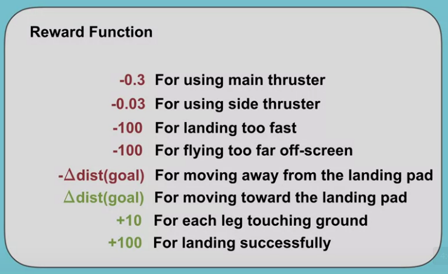

**Video Andy Barto on What are Eligibility Traces and Why are they so named?**

By the end of this video, you'll *understand* the **origin** of the idea of **eligibility traces** and you'll actually *see* that you've been **using a variant of eligibility traces** all along. 

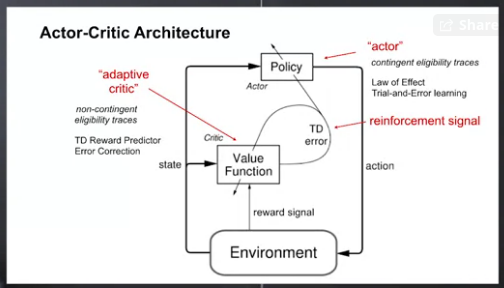

###### Project Resources

**Video Let's Review: Markov Decision Processes**

By the end of this video, you'll be able to *understand* **Markov decision processes or MDPs** and *describe* how the **dynamics of MDP** are defined. 

**Video Let's Review: Examples of Episodic and Continuing Tasks**

By the end of this video, you will be able to *understand* when to formalize a task as **episodic or continuing**. 

###### Assignment

MoonShot Technologies

notebooks in [github](https://github.com/castorfou/Reinforcement-Learning-specialization/tree/main/assignements/course%204%20week%202)

## Course 4 - Week 3 - Choosing The Right Algorithm

######  Weekly Learning Goals

**Video Meeting with Niko: Choosing the Learning Algorithm**

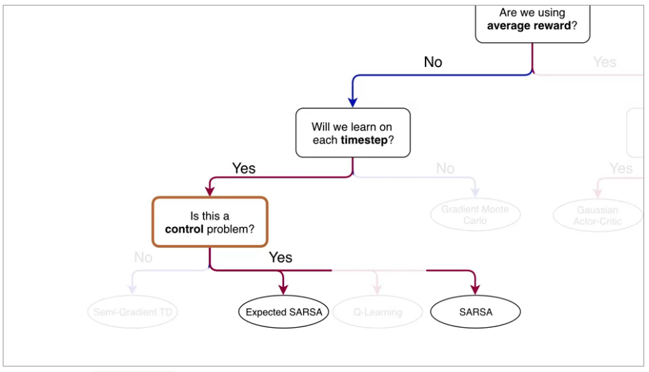

###### Project Resources

**Video Let's Review: Expected Sarsa**

**Video Let's Review: What is Q-learning?**

**Video Let's Review: Average Reward- A New Way of Formulating Control Problems**

**Video Let's Review: Actor-Critic Algorithm**

**Video Csaba Szepesvari on Problem Landscape**

**Video Andy and Rich: Advice for Students**

## Course 4 - Week 4 - Identify Key Performance Parameters

###### Weekly Learning Goals

**Video Agent Architecture Meeting with Martha: Overview of Design Choices**

Now, let's discuss the meta parameter choices that you will have to make to fully implement the agent. This means we need to decide on the **function approximator**, choices in the optimizer for **updating the action values**, and how to **do exploration**. 

###### Project Resources

**Video Let's Review: Non-linear Approximation with Neural Networks**

By the end of this video, you will *understand* how neural networks do **feature construction**, and you will *understand* how neural networks are a **non-linear function** of state. 

**Video Drew Bagnell on System ID + Optimal Control**

**Video Susan Murphy on RL in Mobile Health**

## Course 4 - Week 5 - Implement your agent

###### Weekly Learning Goals

**Video Meeting with Adam: Getting the Agent Details Right**

###### Project Resources

**Video Let's Review: Optimization Strategies for NNs**

By the end of this video, you will be able to *understand* the importance of **initialization** for neural networks and *describe* **optimization techniques** for training neural networks. 

One simple yet effective initialization strategy, is to randomly sample the initial weights from a normal distribution with small variance. This way, each neuron has a different output from other neurons within its layer. This provides a more diverse set of potential features. By keeping the variants small, we ensure that the output of each neuron is within the same range as its neighbors. One downside to this strategy is that, as we add more inputs to a neuron, the variance of the output grows. We can get around this issue by scaling the variance of the weights, by one over the square root of the number of inputs. 

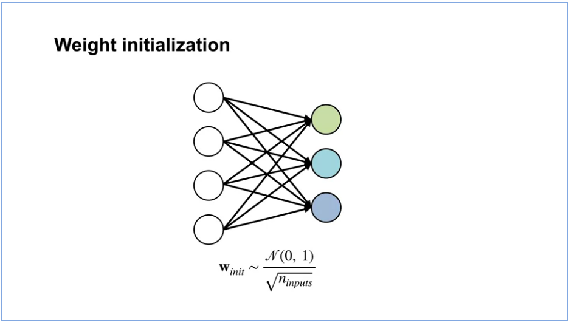

Here's the stochastic gradient descent update rule and here's the update modified to include momentum. Notice, it is similar to the regular stochastic gradient descent update plus an extra term called the momentum M. The momentum term summarizes the history of the gradients using a decaying sum of gradients with decay rate Lambda. If recent gradients have all been in similar directions, then we gained momentum in that direction. This means, we make a large step in that direction. If recent updates have conflicting directions, then it kills the momentum. The momentum term will have little impact on the update and we will make a regular gradient descent step. Momentum provably accelerates learning, meaning it gets to a stationary point more quickly. 

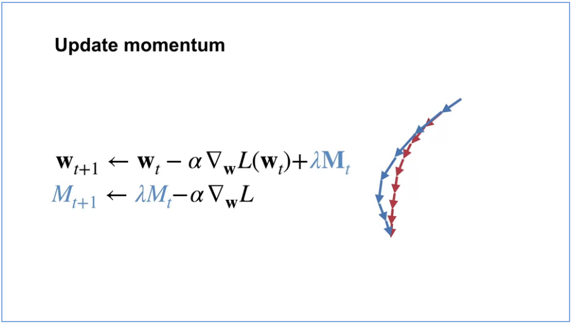

So far, we have only talked about a global scalar step size. This is well-known to be problematic because this can result in updates that are too big for some weights and too small for other weights. Adapting the step sizes for each weight, based on statistics about the learning process in practice results in much better performance. Now, how does the update change? The change is very simple. Instead of updating with a scalar Alpha, there's a vector of step sizes indexed by t to indicate that it can change on each time-step. Each dimension of the gradient, is scaled by its corresponding step size instead of the global step size. There are a variety of methods to adapt a vector of step sizes. You'll get to implement one in your assignment. 

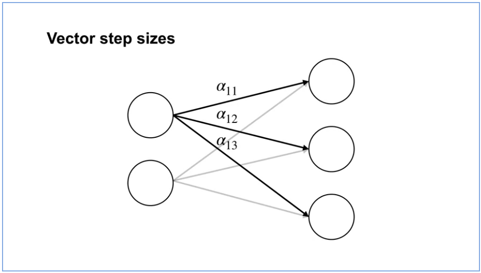

**Video Let's Review: Expected Sarsa with Function Approximation**

By the end of this video, you'll be able to *explain* the update for **expected Sarsa** with **function approximation**, and *explain* the update for **Q-learning** with **function approximation**. 

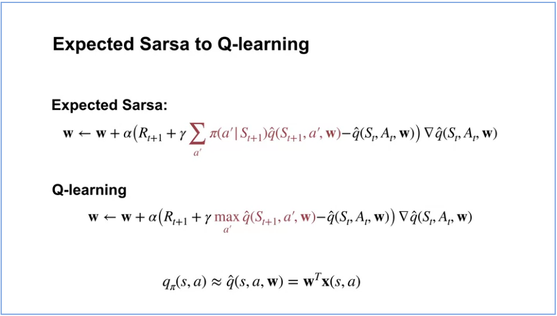

**Video Let's Review: Dyna & Q-learning in a Simple Maze**

By the end of this video you will be able to *describe* how learning from both **real** and **model** experience impacts performance. You will also be able to *explain* how a model allows the agent to learn from **fewer interactions with the environment**. 

**Video Meeting with Martha: In-depth on Experience Replay**

In Course 3, the agents you implemented update the value function or policy only once with each sample. But this is likely not the most sample efficient way to use our data. You have actually seen a smarter approach in Course 2 where we talked about Dyna as a way to be more sample efficient. But we only talked about Dyna for the tabular setting. 

In this video, we will talk about how to make your agent more sample efficient when using function approximation. We will discuss a simple method called **experience replay** and how it relates to Dyna. To get some intuition for experience replay, let's first remember a method that we know well, Dyna-Q. The idea is to learn a model using sample experience. Then simulated experience can be obtained from this model to update the values. This procedure of using simulated experience to improve the value estimates is called planning. 

Experience replay is a simple method for trying to get the advantages of Dyna. The basic idea is to save a buffer of experience and let the data be the model. We sample experience from this buffer and update the value function with those samples similarly to how we sample from the model and update the values in Dyna. 

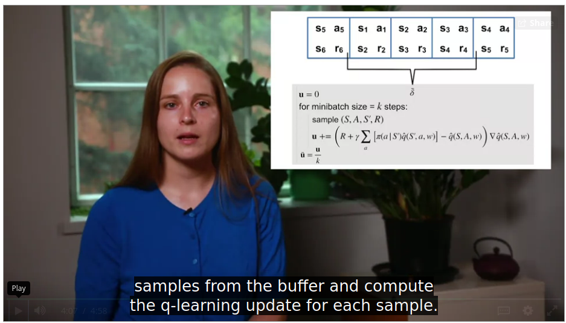

**Video Martin Riedmiller on The 'Collect and Infer' framework for data-efficient RL**

Martin Riedmiller, head of the control team at Deepmind has been working for more than 20 years on New Reinforcement Learning Agents for the control of dynamical systems. 

The control of dynamical systems is an attractive application area for reinforcement learning controllers. They all share the same principle feedback control structure, a controller gets the observation, computes an action and applies it to the environment. Classical control theory would first model the process as a set of differential equations for which then a control law must be analytically derived. A tedious job in particular if the systems are complex or highly nonlinear. Reinforcement learning in contrast promises to be able to learn the controller autonomously. If only the overall control goal is specified. This is typically done by defining the immediate reward. The RL controller optimizes the expected cumulated sum of rewards over time. 

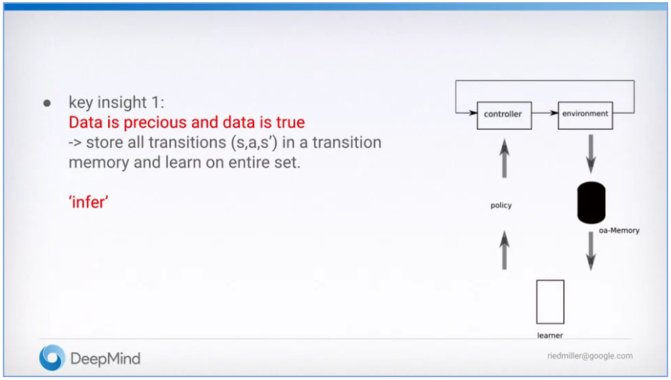

These two steps together build the so-called collecting and infer framework of reinforcement learning. This perspective keeps us focused on the two main question of data efficient RL. Infer, which means squeezing out the most of a given set of transition data. And collect, which means sampling the most formative data from the environment. 

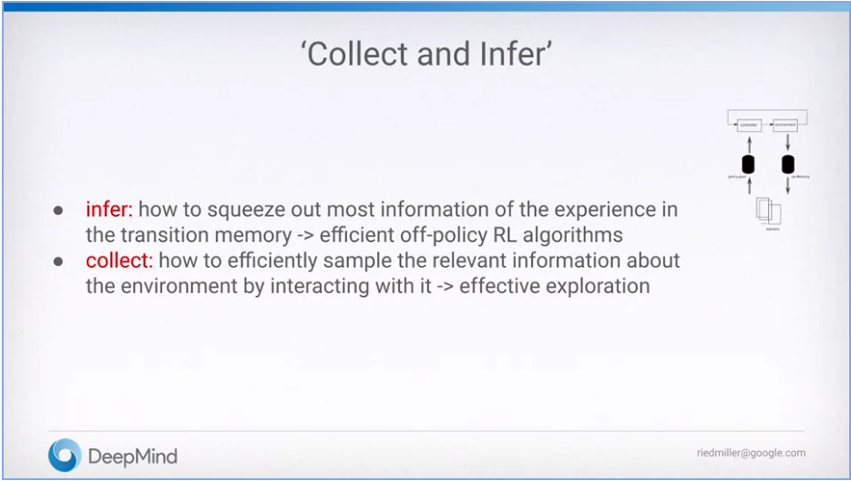

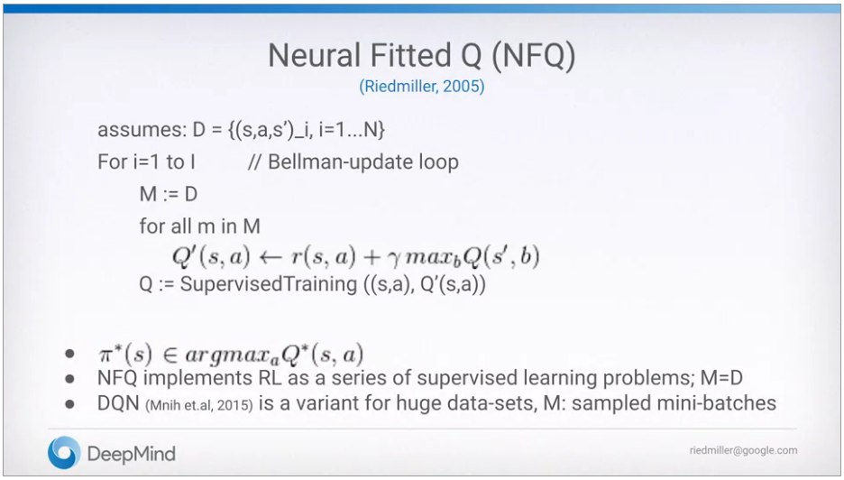

###### Assignment

Implement your agent

notebooks in [github](https://github.com/castorfou/Reinforcement-Learning-specialization/tree/main/assignements/course%204%20week%205)

## Course 4 - Week 6 - Submit your Parameter Study!

###### Weekly Learning Goals

**Video Meeting with Adam: Parameter Studies in RL**

###### Project Resources

**Video Let's Review: Comparing TD and Monte Carlo**

**Video Joelle Pineau about RL that Matters**

###### Assignment

Completing the parameter study

notebooks in [github](https://github.com/castorfou/Reinforcement-Learning-specialization/tree/main/assignements/course%204%20week%206)

###### Congratulations!

**Video Meeting with Martha: Discussing Your Results**

**Video Course Wrap-up**

**Video Specialization Wrap-up**

