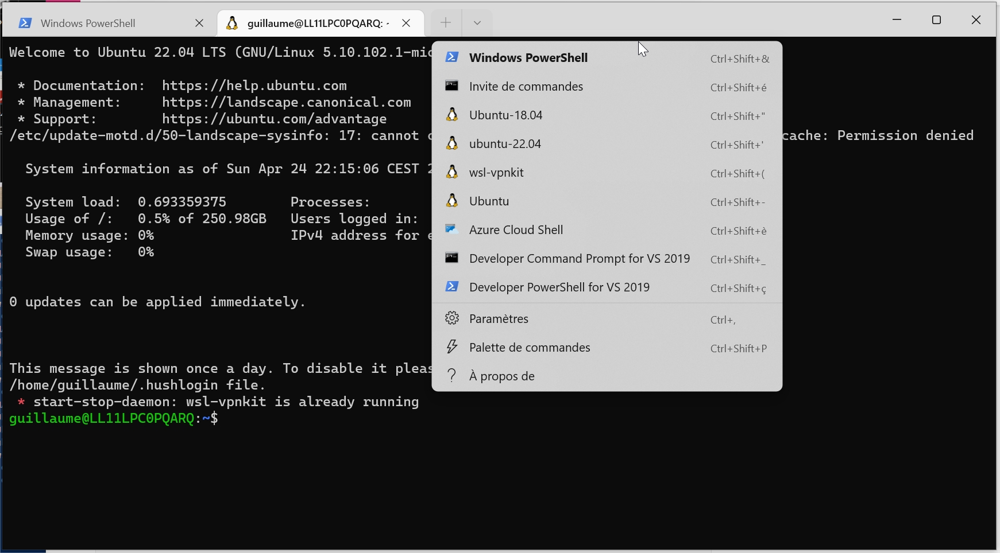

## source of inspiration

[How to install Ubuntu 21.10 on WSL for Windows 10 and 11](https://www.windowscentral.com/how-install-ubuntu-2110-wsl-windows-10-and-11)


## Installation

### uninstall image (if needed)

```powershell
# wsl --unregister <distroName>
wsl --unregister ubuntu-22.04
```


### download images

From [cloud images ubuntu](https://cloud-images.ubuntu.com/jammy/current/) (cloud-images > jammy > current), now there are wsl images:


I just have to download the last jammy (22.04) image `jammy-server-cloudimg-amd64-wsl.rootfs.tar.gz`


### install and setup from powershell

I have downloaded this ubuntu image to `D:\wsl\ubuntu-22.04\download`

```bash
(base) guillaume@LL11LPC0PQARQ:/mnt/d/wsl$ tree
.
├── Ubuntu-20.04
│   └── ext4.vhdx
├── Ubuntu-22.04
│   ├── download
│   │   └── jammy-server-cloudimg-amd64-wsl.rootfs.tar.gz
│   └── instance
```

and my `ubuntu-22.04` instance will stand in `D:\wsl\ubuntu-22.04\instance`


Install with this command from powershell

```powershell
# wsl --import <distroname> <location of instance> <location of download>
wsl --import ubuntu-22.04 D:\wsl\ubuntu-22.04\instance D:\wsl\ubuntu-22.04\download\jammy-server-cloudimg-amd64-wsl.rootfs.tar.gz
```

It takes 3-4 minutes to install. and should be visible in your wsl instances.

```powershell
 wsl --list --all -v
  NAME            STATE           VERSION
  ubuntu-22.04    Stopped         2
```


then to run it

```powershell
# wsl -d <distroname>
wsl -d ubuntu-22.04
```

or

#### use Windows Terminal as a launcher

Windows Terminal is a smart way to group all terminals (powershell, and all your wsl instances)



It can be installed even with limited windows store access by clicking install in [Installer le Terminal Windows et commencer à le configurer](https://docs.microsoft.com/fr-fr/windows/terminal/install)

Automatically all wsl instances appear in Settings.


## Automatic setup

copy these 2 [scripts](https://github.com/castorfou/guillaume_blog/tree/master/files) in /root/ (given they are in `D:\wsl\ubuntu-22.04\download`)

```bash
cp /mnt/d/wsl/Ubuntu-22.04/download/setup_wsl_* .
```


`setup_wsl_root.sh` [download](../files/setup_wsl_root.sh)

```bash
#!/bin/bash

echo "0. get username: "
read user_name

. /etc/lsb-release

echo Configuration for user [$user_name]
echo of distribution $DISTRIB_CODENAME
echo

echo "1. create user and add in sudo"
#adduser --disabled-password --gecos "" $user_name
adduser --gecos "" $user_name
usermod -aG sudo $user_name
echo

echo "2. create wsl.conf file"
rm -rf /etc/wsl.conf
tee /etc/wsl.conf << EOF
# Set the user when launching a distribution with WSL.
[user]
default=$user_name
EOF
echo

echo "3. prepare setup by user"
cp setup_wsl_user.sh /home/$user_name
chown $user_name:users /home/$user_name/setup_wsl_user.sh
chmod 750  /home/$user_name/setup_wsl_user.sh
tee -a /home/$user_name/.bashrc << EOF
if [ ! -e ".wsl_configured" ]; then
		./setup_wsl_user.sh
        touch .wsl_configured
fi
EOF
echo

echo "end of configuration for root"
echo "stop wsl instance by running 'wsl --shutdown <distroname>' from powershell"
echo "and start from Windows Terminal"
```

`setup_wsl_user.sh` [download](../files/setup_wsl_user.sh)

```bash
#!/bin/bash

echo "1. setup wsl-vpnkit"
if grep -Fxq "wsl-vpnkit" ~/.profile
then
    # code if found
	echo "   wsl-vpnkit already setup"
else
    # code if not found
	echo 'wsl.exe -d wsl-vpnkit service wsl-vpnkit start' >> ~/.profile
fi
wsl.exe -d wsl-vpnkit service wsl-vpnkit start
source ./.bashrc
echo

echo "2. create ssh key to copy to gitlab"
. /etc/lsb-release
if [ ! -e ".ssh/id_rsa.pub" ]; then
		ssh-keygen -t rsa -b 4096 -C "WSL2 ubuntu $DISTRIB_RELEASE"
		cat .ssh/id_rsa.pub
		echo "copy this content to gitlab > preferences > SSH Keys"
		read -p "Press any key to resume ..."
fi
echo

echo "3. update certificates"
git clone git@gitlab.michelin.com:devops-foundation/devops_environment.git /tmp/devops_environment
sudo cp /tmp/devops_environment/certs/* /usr/local/share/ca-certificates/
sudo update-ca-certificates
rm -rf /tmp/devops_environment
if [ $DISTRIB_RELEASE == "22.04" ]
then
echo 'bug SSL with ubuntu 22.04 - https://bugs.launchpad.net/ubuntu/+source/openssl/+bug/1963834/comments/7'
sudo tee -a /etc/ssl/openssl.cnf << EOF
[openssl_init]
ssl_conf = ssl_sect

[ssl_sect]
system_default = system_default_sect

[system_default_sect]
Options = UnsafeLegacyRenegotiation
EOF
fi
echo

echo "4. update apt sources with artifactory"
echo 'Acquire { http::User-Agent "Mozilla/5.0 (X11; Ubuntu; Linux x86_64; rv:13.37) Gecko/20100101 Firefox/31.33.7"; };' | sudo tee /etc/apt/apt.conf.d/90globalprotectconf
sudo sed -i 's,http://archive.ubuntu.com/ubuntu,https://artifactory.michelin.com/artifactory/ubuntu-archive-remote,g' /etc/apt/sources.list
sudo sed -i 's,http://security.ubuntu.com/ubuntu,https://artifactory.michelin.com/artifactory/ubuntu-archive-remote,g' /etc/apt/sources.list
sudo apt update
sudo apt upgrade -y
echo
```

Then 

```bash
chmod +x setup_wsl_root.sh
./setup_wsl_root.sh
```

As explained stop wsl instance by running `wsl --shutdown ubuntu-22.04` from powershell
and start from Windows Terminal

It restarts from your user and it will install:

* setup wsl-vpnkit
* create ssh key to copy to gitlab
* update certificates
* update apt sources with artifactory


## And now we can install other parts

### 00 - keep config files in git

```bash
wget -O - https://raw.githubusercontent.com/castorfou/guillaume_blog/master/files/setup_wsl_00_config_files_in_git.sh | bash
source .bashrc
```

### 01 - automount secured vbox

```bash
wget -O - https://raw.githubusercontent.com/castorfou/guillaume_blog/master/files/setup_wsl_01_automount_secured_vbox.sh | bash
```

### 02 - python with conda and configure base environment (jupyterlab, mamba)

```bash
wget -O - https://raw.githubusercontent.com/castorfou/guillaume_blog/master/files/setup_wsl_02_install_python_conda_part1.sh | bash
cd 
source .bashrc
wget -O - https://raw.githubusercontent.com/castorfou/guillaume_blog/master/files/setup_wsl_02_install_python_conda_part2.sh | bash
```

### 03 - bat cat

```bash
wget -O - https://raw.githubusercontent.com/castorfou/guillaume_blog/master/files/setup_wsl_03_install_batcat.sh | bash
source .bashrc
```

### 04 - git access

```bash
ln -s /mnt/d/git/ ~/
```

### 05 - X access with GWSL

[GWSL Homepage](https://opticos.github.io/gwsl/)

if you have access to [Windows Store](https://apps.microsoft.com/store/detail/gwsl/9NL6KD1H33V3?hl=fr-fr&gl=FR), it is available.

Or alternate download are possible.


## Manual setup (skip if to follow automatic setup)

### basic setup

With this way to install, you don't have any user, you don't have any launcher within Windows.

Create a user and add it to sudo:

```bash
# adduser <yourusername>
# usermod -aG sudo <yourusername>
adduser guillaume
usermod -aG sudo guillaume
```

and I can switch to this user simply with

```bash
# su <yourusername>
su guillaume
```


### launch distro with yourusername - update `wsl.conf`

Manually you can now start your distro with your username from powershell

```powershell
# wsl -d <distroname> -u <yourusername>
wsl -d ubuntu-22.04 -u guillaume
```

Or from another wsl (huge avantage to run in linux terminal instead of powershell)

```bash
wsl.exe -d ubuntu-22.04 -u guillaume
```


but you can better keep this username setting by updating `wsl.conf`

```bash
# /etc/wsl.conf
# Set the user when launching a distribution with WSL.
[user]
default=YourUserName
```


It is now setup. You can now shutdown this instance from powershell.

```powershell
# wsl --shutdown <distroname>
wsl --shutdown ubuntu-22.04
```

and when starting `wsl -d ubuntu-22.04`, you reach your username.

### wsl-vpnkit

As wsl-vpnkit is already installed, I just have to

```bash
echo 'wsl.exe -d wsl-vpnkit service wsl-vpnkit start' >> ~/.profile
source .bashrc
```

### gitlab

```bash
ssh-keygen -t rsa -b 4096 -C "WSL2 ubuntu 22.04"
```

and copy `id_rsa.pub` into gitlab > preferences > SSH Keys

### corporate CA certificates

```bash
git clone git@gitlab.michelin.com:devops-foundation/devops_environment.git /tmp/devops_environment
sudo cp /tmp/devops_environment/certs/* /usr/local/share/ca-certificates/
sudo update-ca-certificates
rm -rf /tmp/devops_environment
```

### apt sources

had to replace focal (20.04) to jammy (22.04)

```bash
echo 'Acquire { http::User-Agent "Mozilla/5.0 (X11; Ubuntu; Linux x86_64; rv:13.37) Gecko/20100101 Firefox/31.33.7"; };' | sudo tee /etc/apt/apt.conf.d/90globalprotectconf
sudo sed -i 's@^\(deb \)http://archive.ubuntu.com/ubuntu/\( jammy\(-updates\)\?.*\)$@\1https://artifactory.michelin.com/artifactory/ubuntu-archive-remote\2\n# &@' /etc/apt/sources.list
sudo sed -i 's@^\(deb \)http://security.ubuntu.com/ubuntu/\( jammy\(-updates\)\?.*\)$@\1https://artifactory.michelin.com/artifactory/ubuntu-security-remote\2\n# &@' /etc/apt/sources.list
```

### check everything is ok

- This command must return google ip:

```bash
  host google.fr
```

- This command must return artifactory ip:

```bash
  host artifactory.michelin.com
```

- You are able to update your distribution without error:

```bash
  sudo apt update
  sudo apt upgrade -y
```


### Setup config dotfiles with whole filesystem (/)

as detailed in [keep dotfiles in git](https://castorfou.github.io/guillaume_blog/blog/keep-dotfiles-in-git.html)

but to manage the whole filesystem.

#### init local repo

```bash
sudo mkdir -p /.cfg
sudo chown $USER:users /.cfg
git init --bare /.cfg
alias config='/usr/bin/git --git-dir=/.cfg/ --work-tree=/'
config config --local status.showUntrackedFiles no
echo "alias config='/usr/bin/git --git-dir=/.cfg/ --work-tree=/'" >> $HOME/.bash_aliases
cd
source .bashrc
```

#### git default identity (if needed)

```bash
config config --global user.email "guillaume.ramelet@michelin.com"
config config --global user.name "guillaume"
```

#### setup branch and push to central repo

```bash
config remote add origin git@gitlab.michelin.com:janus/dotfiles.git
config fetch
cd
config add .bashrc
config commit -m 'init with .bashrc'

config branch GR_WSL2_ubuntu22.04
config checkout GR_WSL2_ubuntu22.04
config push --set-upstream origin GR_WSL2_ubuntu22.04
```

