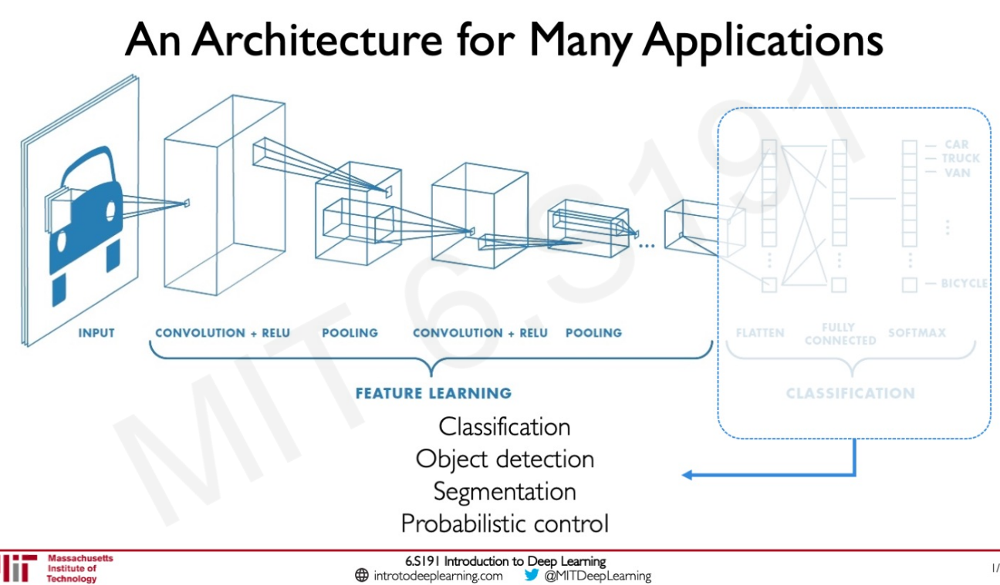

# Auto-convert markdown files To Posts

[`fastpages`](https://github.com/fastai/fastpages) will automatically convert markdown files saved into this directory as blog posts!

You must save your notebook with the naming convention `YYYY-MM-DD-*.md`.  Examples of valid filenames are:

```shell
2020-01-28-My-First-Post.md
2012-09-12-how-to-write-a-blog.md
```

# Resources

- [Jekyll posts](https://jekyllrb.com/docs/posts/)
- [Example markdown post](https://github.com/fastai/fastpages/blob/master/_posts/2020-01-14-test-markdown-post.md)


# Mardown header

```markdon
title: "Practicing: Deep Reinforcement Learning Course by Thomas Simonini"
description: A Free course in Deep Reinforcement Learning from beginner to expert. My notes
toc: true
comments: true
layout: post
categories: [reinforcement learning]
image: images/<my_image_preview>.png
```


here are some images


# Latex Reference

https://en.wikibooks.org/wiki/LaTeX/Mathematics


# Quelques exemples

$$
\widehat{q}
\\
| x-x_M |
\\
f_M(x)
\\
\displaystyle\sum_{m}
\\
\langle{x,w_m}\rangle
\\
\| v_m \|
\\
\cos
\\
\Z^d
\\
\infty
\\
f \in L^2
\\
\implies 
\\
\lim\limits_{M \to \infty}
\\
P(A|B) = \frac{P(B|A)*P(A)}{P(B)}
\\
\begin{align}
Q_t(a) &= \frac{\text{sum of rewards when } \mathit{a} \text{ taken prior to }\mathit{t}}{\text{number of times } \mathit{a} \text{ taken prior to }\mathit{t}} \\
& = \frac{\displaystyle\sum_{i=1}^{t-1} R_i.\mathcal{1}_{A_i=a}}{\displaystyle\sum_{i=1}^{t-1} \mathcal{1}_{A_i=a}}
\end{align}
\\
A_t=\underset{a}{\mathrm{argmax}}{\text{ }Q_t(a)}
\\
p(s',r|s,a) \doteq Pr\{S_t=s', R_t=r|S_{t-1}=s, A_{t-1}=a\}
\\
q_\pi(s,a) \doteq \mathbb{E}[R_{t+1}+\gamma.G_{t+1}|S_t=s, A_t=a]
\\
v_*(s)\doteq \max\limits_{\pi} v_\pi(s), \forall s \in S
\\
q_\pi(s,a) \doteq \mathbb{E}[R_{t+1}+\gamma.G_{t+1}|S_t=s, A_t=a]
\\
l(w,b)=\frac{1}{N}\displaystyle\sum_{n=1}^{N}(y_n-(x_nw+b))^2
\\
\nabla l(w,b) = \begin{bmatrix}\frac{\partial l(w,b)}{\partial w_1}\\ \vdots \\\frac{\partial l(w,b)}{\partial w_d}\end{bmatrix}
\\
\\ H(X) = – \sum_{x \in X} P(x) * \log(P(x))
$$


# Link to local image

``



